# User Flows — CoachFit

## 1. Đăng Ký & Onboarding

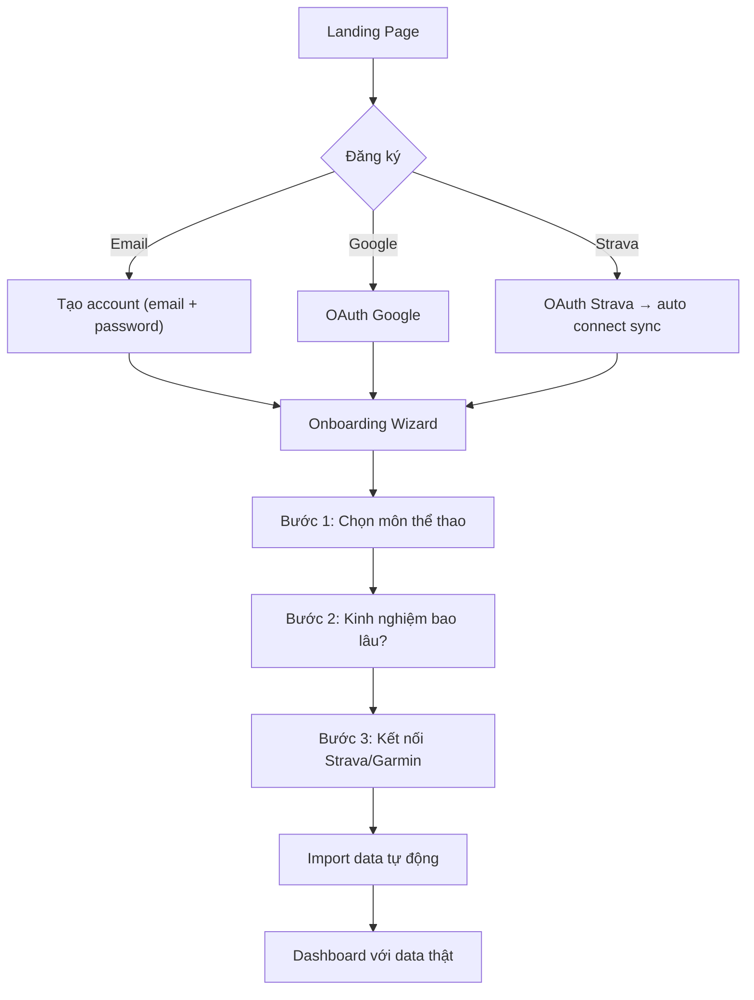

**Ghi chú:** Nếu đăng ký qua Strava, bước 3 auto-skip. Data import chạy background, dashboard hiện ngay dù data chưa import xong (loading state).

---

## 2. Strava Webhook Sync

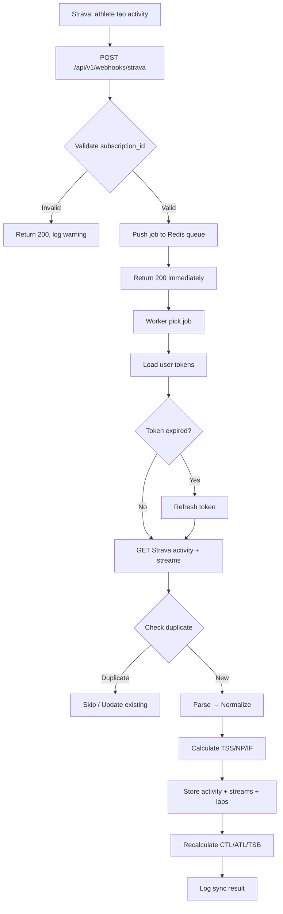

**Ghi chú:** Strava yêu cầu respond 200 trong <2 giây. Mọi xử lý nặng đều qua Redis queue.

---

## 3. Upload FIT File

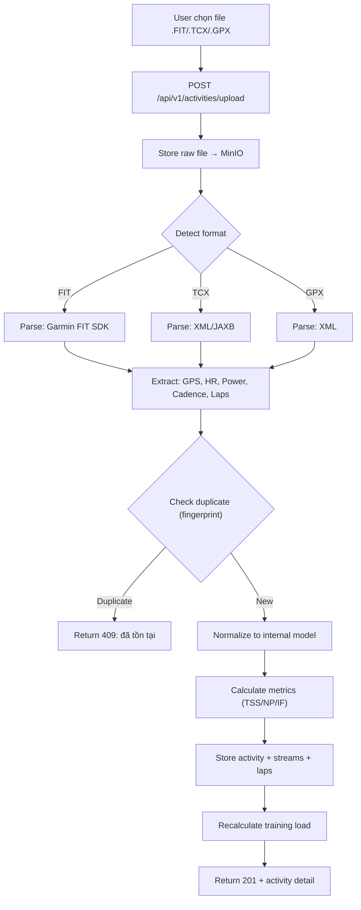

---

## 4. Tạo Workout

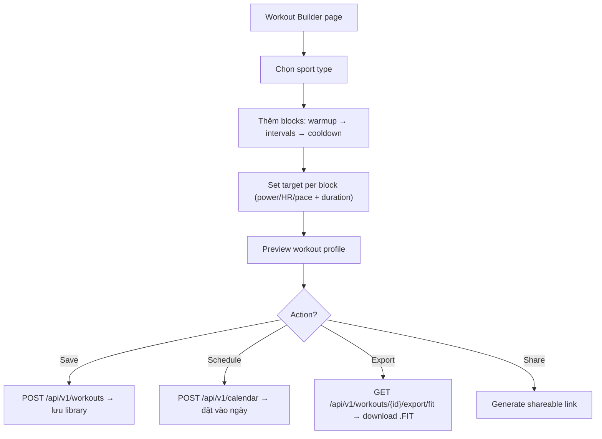

**Ghi chú:** Workout builder dùng drag-and-drop blocks. KHÔNG dùng text syntax như Intervals.icu. Preview hiện bar chart với màu theo zone.

---

## 5. Daily Workflow

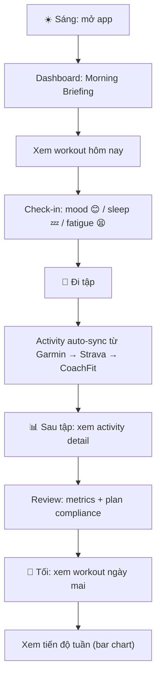

**Ghi chú:** Đây là workflow chính. Dashboard phải load trong <2 giây. Morning briefing = touchpoint quan trọng nhất.

---

## 6. Subscription Upgrade

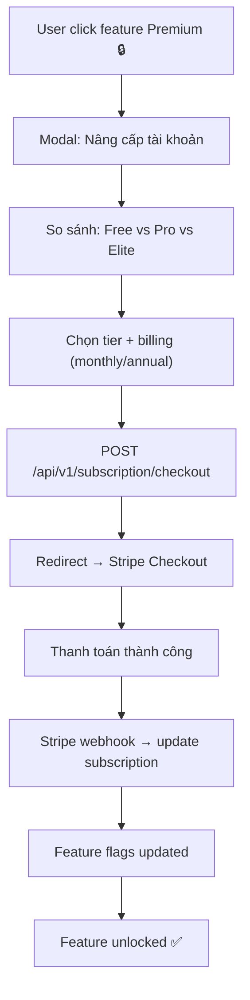

**Ghi chú:** Trước khi có Stripe (Phase 1), chỉ hiện "Coming soon — hiện tại tất cả FREE". Stripe integrate ở Phase 2.

---

## 7. API Usage (Developer)

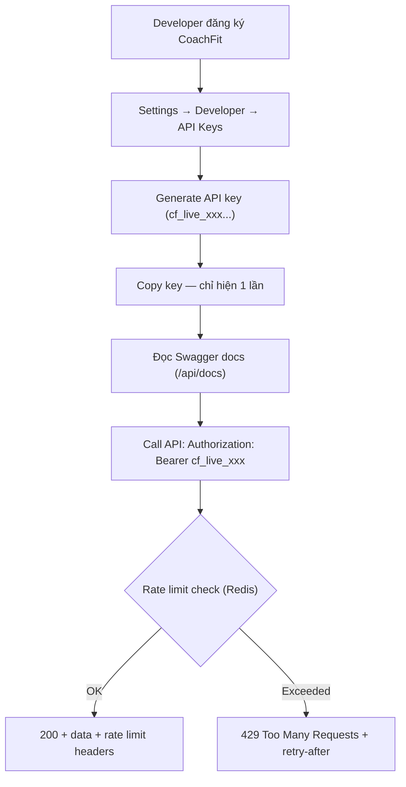

**Ghi chú:** API key khác JWT token. API key dùng cho external access (automation, integration). JWT dùng cho browser session.

---

## Coach Flows

### Flow: Coach Invite Athlete (Email)

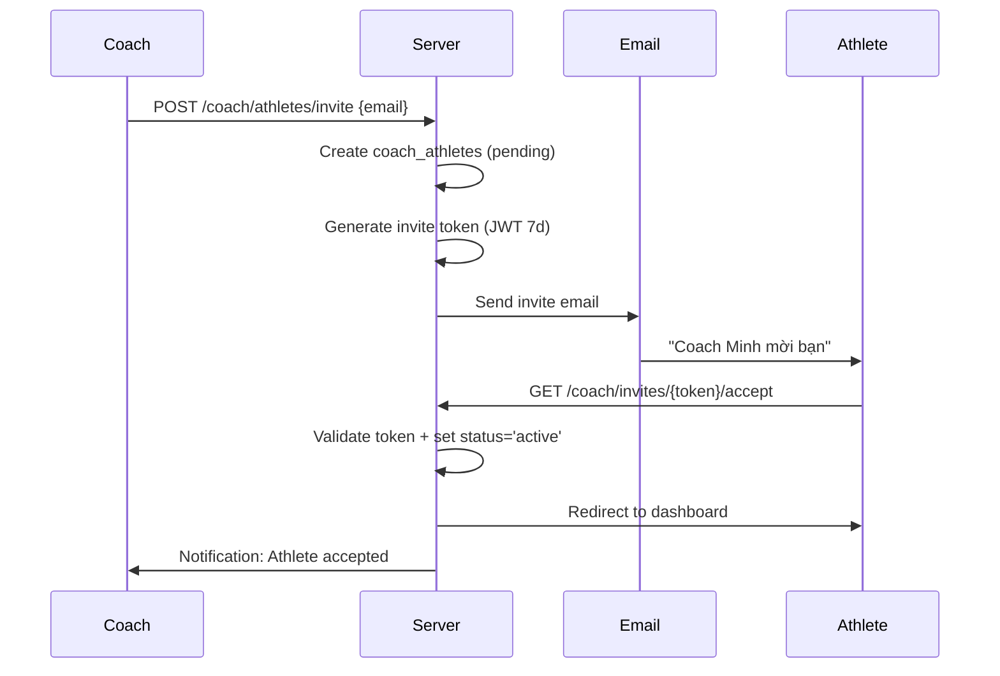

### Flow: Coach Invite Athlete (Link)

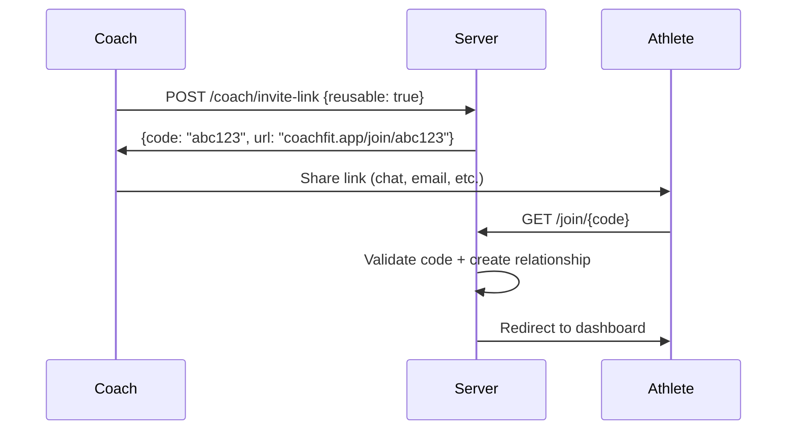

### Flow: Coach Assign Workout

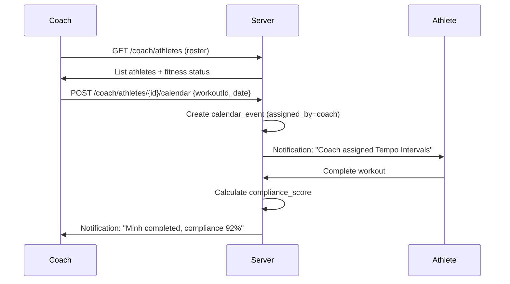

### Flow: Coach View Athlete Data

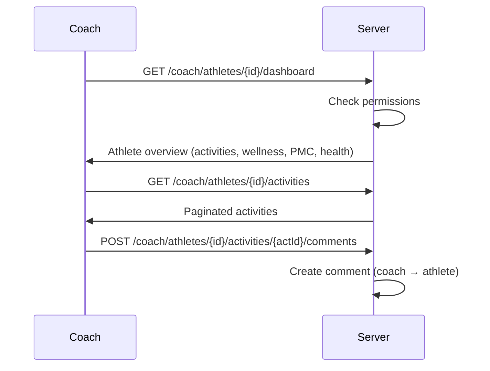

### Flow: Athlete Manage Coach Access

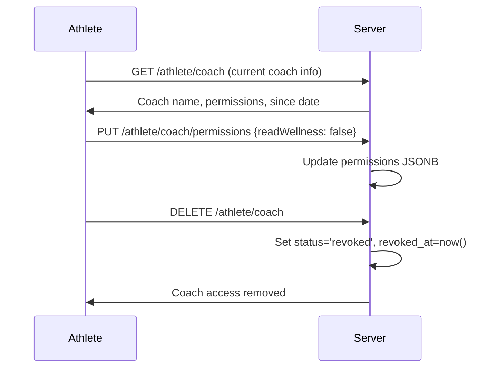
