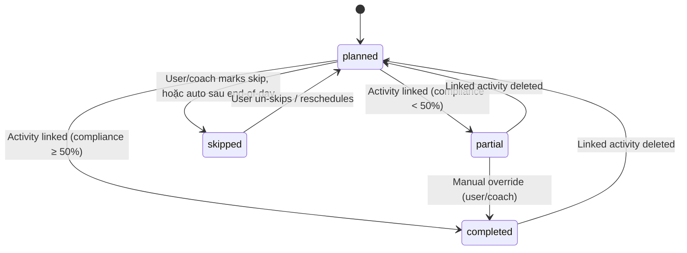

# API Design — CoachFit

## Conventions

| Item | Convention |
|---|---|
| Base URL | `/api/v1` |
| Format | JSON (application/json) |
| Auth | `Authorization: Bearer <JWT>` hoặc `Bearer <API_KEY>` |
| Pagination | `?page=0&size=20` (0-indexed) |
| Sort | `?sort=startedAt,desc` |
| Date filter | `?from=2025-01-01&to=2025-03-31` |
| Error | `{ "error": { "code": "NOT_FOUND", "message": "..." } }` |
| Rate limit | Headers: `X-RateLimit-Limit`, `X-RateLimit-Remaining`, `X-RateLimit-Reset` |

### Idempotency

| Header | Giá trị | Áp dụng cho |
|---|---|---|
| `Idempotency-Key` | UUID (client-generated) | POST endpoints có side effects |

**Endpoints yêu cầu idempotency key:**
- `POST /activities/upload` — tránh duplicate upload khi retry
- `POST /coach/athletes/invite` — tránh gửi invite 2 lần
- `POST /coach/athletes/bulk-assign` — tránh assign double

**Implementation:** Redis `SETEX idempotency:{key} 86400 {response}`. Nếu key tồn tại → trả cached response (200).

> Các endpoint tự nhiên idempotent (PUT, DELETE) không cần idempotency key.

## Status Codes

| Code | Dùng khi |
|---|---|
| 200 | Success |
| 201 | Created |
| 204 | Deleted (no content) |
| 400 | Bad request / validation error |
| 401 | Unauthorized (no/invalid token) |
| 403 | Forbidden (wrong tier / permission) |
| 404 | Not found |
| 409 | Conflict (duplicate) |
| 429 | Rate limit exceeded |
| 500 | Server error |

### Versioning Strategy

| Rule | Chi tiết |
|---|---|
| Method | URL-based: `/api/v1`, `/api/v2` |
| Non-breaking changes | Thêm fields mới vào response — cho phép trong cùng version |
| Breaking changes | Đổi/xóa fields, đổi response structure — yêu cầu version mới |
| Deprecation | Thông báo 6 tháng trước khi retire version cũ |
| Header | `X-API-Version: v1` trong response (informational) |
| Sunset | Header `Sunset: Sat, 01 Jan 2028 00:00:00 GMT` khi deprecating |

---

## Auth

| Method | Endpoint | Mô tả | Auth |
|---|---|---|---|
| POST | `/auth/register` | Email/password register | ❌ |
| POST | `/auth/login` | Email/password → JWT | ❌ |
| POST | `/auth/refresh` | Refresh token → new JWT | Cookie |
| POST | `/auth/logout` | Invalidate refresh token | ✅ |
| GET | `/auth/oauth/strava` | Initiate Strava OAuth 2.0 | ❌ |
| GET | `/auth/oauth/strava/callback` | Strava callback | ❌ |
| GET | `/auth/oauth/google` | Initiate Google OAuth | ❌ |
| GET | `/auth/oauth/google/callback` | Google callback | ❌ |
| GET | `/auth/oauth/garmin` | Initiate Garmin OAuth 1.0a | ❌ |
| GET | `/auth/oauth/garmin/callback` | Garmin callback | ❌ |

### POST /auth/register

```json
// Request
{ "email": "minh@example.com", "password": "securepass123", "fullName": "Minh Nguyen" }

// Response 201
{ "token": "eyJ...", "user": { "id": "uuid", "email": "...", "role": "athlete", "tier": "free" } }
```

### POST /auth/login

```json
// Request
{ "email": "minh@example.com", "password": "securepass123" }

// Response 200
{ "token": "eyJ...", "refreshToken": "(httpOnly cookie)", "user": { "id": "uuid", "email": "...", "role": "athlete", "tier": "free" } }
```

---

## Athlete Profile

| Method | Endpoint | Mô tả | Tier |
|---|---|---|---|
| GET | `/athlete` | Get current profile | 🆓 |
| PUT | `/athlete` | Update profile | 🆓 |
| GET | `/athlete/zones` | List all sport zones | 🆓 |
| PUT | `/athlete/zones/{sport}` | Update zones for sport | 🆓 |
| GET | `/athlete/connections` | List connected platforms | 🆓 |
| DELETE | `/athlete/connections/{provider}` | Disconnect platform | 🆓 |

### GET /athlete

```json
// Response 200
{
  "id": "uuid",
  "email": "minh@example.com",
  "fullName": "Minh Nguyen",
  "avatarUrl": null,
  "role": "athlete",
  "tier": "free",
  "profile": {
    "sports": ["cycling", "running", "swimming"],
    "primarySport": "cycling",
    "experienceLevel": "intermediate",
    "weightKg": 72.5,
    "gender": "male"
  },
  "settings": { "locale": "vi", "units": "metric", "timezone": "Asia/Ho_Chi_Minh" }
}
```

---

## Activities

| Method | Endpoint | Mô tả | Tier |
|---|---|---|---|
| GET | `/activities` | List (paginated, filterable) | 🆓 30d / 💎 all |
| GET | `/activities/{id}` | Detail with metrics | 🆓 |
| GET | `/activities/{id}/streams` | Time-series data | 🆓 |
| GET | `/activities/{id}/laps` | Laps data | 🆓 |
| POST | `/activities/upload` | Upload FIT/TCX/GPX | 🆓 |
| PUT | `/activities/{id}` | Update (name, desc, gear) | 🆓 |
| DELETE | `/activities/{id}` | Delete | 🆓 |
| GET | `/activities/{id}/download` | Download original file | 🆓 |

### GET /activities

```
GET /api/v1/activities?page=0&size=20&sport=cycling&source=garmin&from=2025-01-01&sort=startedAt,desc
```

```json
// Response 200
{
  "content": [
    {
      "id": "uuid",
      "sport": "cycling",
      "name": "Morning Ride",
      "startedAt": "2025-03-15T06:30:00Z",
      "durationSeconds": 3600,
      "distanceMeters": 42500.00,
      "avgHeartRate": 145,
      "avgPower": 210,
      "tss": 75.5,
      "source": "strava"
    }
  ],
  "page": 0,
  "size": 20,
  "totalElements": 156,
  "totalPages": 8
}
```

### GET /activities/{id}

```json
// Response 200
{
  "id": "uuid",
  "sport": "cycling",
  "subSport": null,
  "name": "Morning Ride",
  "description": "Easy endurance ride",
  "startedAt": "2025-03-15T06:30:00Z",
  "durationSeconds": 3600,
  "movingTimeSeconds": 3420,
  "distanceMeters": 42500.00,
  "elevationGainMeters": 320.00,
  "calories": 850,
  "avgHeartRate": 145,
  "maxHeartRate": 172,
  "avgPower": 210,
  "maxPower": 650,
  "normalizedPower": 225,
  "intensityFactor": 0.865,
  "tss": 75.5,
  "avgCadence": 88,
  "avgSpeed": 31.2,
  "startLat": 10.7769,
  "startLng": 106.7009,
  "gear": { "id": "uuid", "name": "Giant TCR" },
  "source": "strava",
  "rawFileFormat": "fit"
}
```

### POST /activities/upload

```
POST /api/v1/activities/upload
Content-Type: multipart/form-data

file: (binary .fit/.tcx/.gpx)
```

```json
// Response 201
{ "id": "uuid", "name": "Afternoon Ride", "sport": "cycling", ... }

// Response 409 (duplicate)
{ "error": { "code": "DUPLICATE", "message": "Activity already exists", "existingId": "uuid" } }
```

---

## Workouts

| Method | Endpoint | Mô tả | Tier |
|---|---|---|---|
| GET | `/workouts` | List user library | 🆓 |
| GET | `/workouts/{id}` | Detail | 🆓 |
| POST | `/workouts` | Create | 🆓 template / 💎 custom |
| PUT | `/workouts/{id}` | Update | 🆓 |
| DELETE | `/workouts/{id}` | Delete | 🆓 |
| GET | `/workouts/{id}/export/fit` | Export as .FIT | 💎 |
| GET | `/workouts/templates` | System templates | 🆓 |

### POST /workouts

```json
// Request
{
  "name": "Tempo Intervals",
  "sport": "cycling",
  "description": "3x10min tempo",
  "steps": [
    { "type": "warmup", "duration": {"type":"time","value":600}, "target": {"type":"power_zone","zone":2} },
    { "type": "repeat", "count": 3, "steps": [
      { "type": "work", "duration": {"type":"time","value":600}, "target": {"type":"power_pct","min":0.88,"max":0.92} },
      { "type": "rest", "duration": {"type":"time","value":300}, "target": {"type":"power_zone","zone":1} }
    ]},
    { "type": "cooldown", "duration": {"type":"time","value":600}, "target": {"type":"power_zone","zone":1} }
  ],
  "tags": ["tempo", "intervals"]
}

// Response 201
{ "id": "uuid", "name": "Tempo Intervals", ... }
```

---

## Calendar

### Calendar Event States



> **Auto-skip rule:** Calendar events với status='planned' và date < today được auto-mark 'skipped' bởi scheduled job chạy mỗi ngày lúc 23:59 UTC. Coach có thể override.

| Method | Endpoint | Mô tả | Tier |
|---|---|---|---|
| GET | `/calendar?from=...&to=...` | Events in range | 🆓 |
| POST | `/calendar` | Create event | 🆓 |
| PUT | `/calendar/{id}` | Update | 🆓 |
| DELETE | `/calendar/{id}` | Delete | 🆓 |
| PUT | `/calendar/{id}/complete` | Mark completed | 🆓 |
| PUT | `/calendar/{id}/skip` | Mark skipped | 🆓 |
| POST | `/calendar/reorder` | Reorder same-day events | 🆓 |

### GET /calendar

```
GET /api/v1/calendar?from=2025-03-01&to=2025-03-31
```

```json
// Response 200
// Note: Calendar dùng date-range filter thay vì pagination.
// Trả flat array vì số events trong 1 range (thường 1 tháng) luôn nhỏ.
[
  {
    "id": "uuid",
    "date": "2025-03-15",
    "eventType": "workout",
    "title": "Tempo Intervals",
    "status": "completed",
    "workout": { "id": "uuid", "sport": "cycling", "estimatedDuration": 3600 },
    "activity": { "id": "uuid", "tss": 75.5, "durationSeconds": 3650 },
    "complianceScore": 92.5,
    "orderIndex": 0,
    "assignedBy": null
  },
  {
    "id": "uuid",
    "date": "2025-03-16",
    "eventType": "rest",
    "title": "Rest Day",
    "status": "planned",
    "orderIndex": 0,
    "assignedBy": null
  }
]
```

---

## Dashboard

| Method | Endpoint | Mô tả | Tier |
|---|---|---|---|
| GET | `/dashboard/today` | Morning briefing | 🆓 |
| GET | `/dashboard/weekly-summary` | Weekly volume | 🆓 |
| GET | `/dashboard/fitness-trend?days=90` | CTL sparkline | 🆓 basic / 💎 full |

### GET /dashboard/today

```json
// Response 200
{
  "greeting": "Chào buổi sáng, Minh!",
  "todayWorkout": { "id": "uuid", "title": "Easy Run 45min", "sport": "running" },
  "healthSnapshot": {
    "source": "garmin",  // dynamic: lấy từ athlete_profiles.primary_health_source
    "restingHr": 52,
    "sleepScore": 82,
    "sleepHours": 7.5,
    "sleepStages": { "deep": 65, "light": 180, "rem": 95, "awake": 20 },
    "hrv": 45.2,
    "hrvStatus": "balanced",
    "bodyBattery": 78,
    "stressAvg": 28,
    "steps": 3200,
    "spo2": 96.5
  },
  "fitnessStatus": { "ctl": 72, "atl": 58, "tsb": 14, "trend": "improving" },
  "weekProgress": { "plannedHours": 12, "completedHours": 8.5, "percentage": 71 },
  "lastWellness": { "date": "2025-03-14", "mood": 4, "rpe": 6 },
  "recentActivities": [ ... ]
}
```

---

## Wellness & Health Data

| Method | Endpoint | Mô tả | Tier |
|---|---|---|---|
| GET | `/wellness?from=...&to=...` | Wellness entries (manual + auto) | 🆓 |
| POST | `/wellness` | Log manual wellness | 🆓 |
| PUT | `/wellness/{date}` | Update wellness | 🆓 |
| GET | `/health/daily?from=...&to=...` | Daily summaries (steps, HR, stress...) — tất cả providers | 🆓 |
| GET | `/health/sleep?from=...&to=...` | Sleep data (stages, score, HRV) — tất cả providers | 🆓 |
| GET | `/health/trends?metric=resting_hr&days=90` | Health metric trend (any source) | 🆓 basic / 💎 full |

> **Note:** Health APIs trả data từ mọi provider đã connect (Garmin, COROS, Polar...). Field `source` trong response cho biết data đến từ đâu. Client không cần biết provider nào — chỉ cần hiển data.

---

## Training Load (Phase 2)

| Method | Endpoint | Tier |
|---|---|---|
| GET | `/training-load/pmc?from=...&to=...` | 💎 Pro |
| GET | `/training-load/power-curve?days=90` | 💎 Pro |
| GET | `/training-load/zones?from=...&to=...&sport=...` | 💎 Pro |

---

## API Keys

| Method | Endpoint | Tier |
|---|---|---|
| GET | `/api-keys` | 🆓 |
| POST | `/api-keys` | 🆓 |
| DELETE | `/api-keys/{id}` | 🆓 |

---

## Subscription

| Method | Endpoint | Tier |
|---|---|---|
| GET | `/subscription` | 🆓 |
| POST | `/subscription/checkout` | 🆓 |
| POST | `/subscription/portal` | 💎 |
| POST | `/webhooks/stripe` | Internal |

---

## Sync

| Method | Endpoint | Tier |
|---|---|---|
| GET | `/sync/status` | 🆓 |
| POST | `/sync/trigger/{provider}` | 🆓 |
| GET | `/sync/logs?page=0&size=20` | 🆓 |

---

## Webhooks (Incoming)

| Method | Endpoint | Mô tả |
|---|---|---|
| POST | `/webhooks/strava` | Strava event webhook |
| GET | `/webhooks/strava` | Strava webhook verification |
| POST | `/webhooks/garmin/dailies` | Garmin daily summary push |
| POST | `/webhooks/garmin/activities` | Garmin activity push |
| POST | `/webhooks/garmin/activity-details` | Garmin activity streams push |
| POST | `/webhooks/garmin/sleep` | Garmin sleep data push |
| POST | `/webhooks/garmin/body` | Garmin body composition push |
| POST | `/webhooks/garmin/stress` | Garmin stress data push |
| POST | `/webhooks/garmin/hrv` | Garmin HRV data push |
| POST | `/webhooks/garmin/pulseox` | Garmin Pulse Ox push |
| POST | `/webhooks/garmin/respiration` | Garmin respiration push |
| POST | `/webhooks/garmin/user-metrics` | Garmin VO2max/training status |
| POST | `/webhooks/garmin/deregistration` | User unlinked Garmin |
| POST | `/webhooks/stripe` | Stripe payment webhook |

---

## Gear

| Method | Endpoint | Tier |
|---|---|---|
| GET | `/gear` | 🆓 |
| POST | `/gear` | 🆓 |
| PUT | `/gear/{id}` | 🆓 |
| DELETE | `/gear/{id}` | 🆓 |

---

## Coach — Roster Management

| Method | Endpoint | Mô tả | Tier |
|---|---|---|---|
| GET | `/coach/athletes` | List all athletes in roster | 🏷️ Coach |
| GET | `/coach/athletes/{athleteId}` | Athlete detail (profile + stats) | 🏷️ Coach |
| POST | `/coach/athletes/invite` | Invite athlete by email | 🏷️ Coach |
| DELETE | `/coach/athletes/{athleteId}` | Remove athlete from roster | 🏷️ Coach |
| PUT | `/coach/athletes/{athleteId}/tags` | Update athlete tags | 🏷️ Coach |
| PUT | `/coach/athletes/{athleteId}/nickname` | Set athlete nickname | 🏷️ Coach |
| PUT | `/coach/athletes/{athleteId}/notes` | Update coach notes | 🏷️ Coach |

### GET /coach/athletes

```json
// Response 200
{
  "content": [
    {
      "id": "uuid",
      "athleteId": "uuid",
      "name": "Minh Nguyen",
      "nickname": "Minh - Ironman",
      "avatarUrl": null,
      "status": "active",
      "sports": ["cycling", "running", "swimming"],
      "tags": ["ironman", "advanced"],
      "fitness": { "ctl": 72.5, "atl": 58.3, "tsb": 14.2 },
      "lastActivity": { "date": "2025-03-15", "sport": "cycling", "name": "Morning Ride" },
      "healthSnapshot": { "restingHr": 52, "sleepScore": 82 },
      "acceptedAt": "2025-01-15T08:00:00Z"
    }
  ],
  "page": 0,
  "size": 20,
  "totalElements": 8
}
```

### POST /coach/athletes/invite

```json
// Request
{ "email": "athlete@example.com", "nickname": "Newbie Runner", "tags": ["beginner"] }

// Response 201
{ "id": "uuid", "status": "pending", "invitedAt": "2025-03-15T08:00:00Z" }

// Response 409 (already exists)
{ "error": { "code": "ALREADY_CONNECTED", "message": "Athlete already in your roster" } }
```

---

## Coach — Invite Links

| Method | Endpoint | Mô tả | Tier |
|---|---|---|---|
| GET | `/coach/invite-links` | List invite links | 🏷️ Coach |
| POST | `/coach/invite-links` | Create invite link | 🏷️ Coach |
| DELETE | `/coach/invite-links/{id}` | Deactivate link | 🏷️ Coach |
| GET | `/join/{code}` | Accept invite (public) | 🆓 |
| GET | `/coach/invites/{token}/accept` | Accept email invite | 🆓 |

### POST /coach/invite-links

```json
// Request
{ "isReusable": true, "maxUses": 20, "expiresInDays": 30 }

// Response 201
{ "id": "uuid", "code": "abc123xyz789", "url": "https://coachfit.app/join/abc123xyz789", "isReusable": true }
```

> **Lưu ý về URL patterns:**
> - `/coach/athletes/invite` — invite qua email (tạo relationship trực tiếp)
> - `/coach/invite-links` — quản lý shareable links (tạo link, list, deactivate)
> - `/join/{code}` — public endpoint cho athlete accept invite link (không cần auth nếu chưa đăng nhập)
> - `/coach/invites/{token}/accept` — accept email invite (token trong email link)
>
> Phân tách này có chủ đích: email invite tạo relationship 1-1, invite link là reusable resource.

---

## Coach — Athlete Data Access

| Method | Endpoint | Mô tả | Perm |
|---|---|---|---|
| GET | `/coach/athletes/{id}/dashboard` | Athlete overview | viewProfile |
| GET | `/coach/athletes/{id}/activities` | Athlete activities (paginated) | readActivities |
| GET | `/coach/athletes/{id}/activities/{actId}` | Activity detail | readActivities |
| GET | `/coach/athletes/{id}/activities/{actId}/streams` | Activity streams | readActivityStreams |
| GET | `/coach/athletes/{id}/calendar?from=...&to=...` | Athlete calendar | readActivities |
| GET | `/coach/athletes/{id}/wellness?from=...&to=...` | Athlete wellness | readWellness |
| GET | `/coach/athletes/{id}/health/daily?from=...&to=...` | Athlete health data | readHealthData |
| GET | `/coach/athletes/{id}/training-load/pmc?from=...&to=...` | Athlete PMC chart | readTrainingLoad |
| GET | `/coach/athletes/{id}/zones` | Athlete zones | viewZones |

### GET /coach/athletes/{id}/dashboard

```json
// Response 200
{
  "athlete": { "id": "uuid", "name": "Minh Nguyen", "nickname": "Minh - Ironman" },
  "fitness": { "ctl": 72.5, "atl": 58.3, "tsb": 14.2, "trend": "building" },
  "weekSummary": { "plannedHours": 12, "completedHours": 9.5, "compliance": 79 },
  "recentActivities": [ ... ],
  "healthSnapshot": { "restingHr": 52, "sleepScore": 82, "hrv": 45.2 },
  "alerts": [
    { "type": "missed_workout", "date": "2025-03-14", "workout": "Tempo Run" },
    { "type": "elevated_hr", "value": 58, "baseline": 52 }
  ]
}
```

---

## Coach — Workout Assignment

| Method | Endpoint | Mô tả | Perm |
|---|---|---|---|
| POST | `/coach/athletes/{id}/calendar` | Assign workout to athlete's calendar | writeCalendar |
| PUT | `/coach/athletes/{id}/calendar/{eventId}` | Update assigned event | writeCalendar |
| DELETE | `/coach/athletes/{id}/calendar/{eventId}` | Remove assigned event | writeCalendar |
| POST | `/coach/athletes/{id}/workouts` | Add workout to athlete's library | writeWorkouts |
| POST | `/coach/athletes/bulk-assign` | Assign workout to multiple athletes | writeCalendar |

### POST /coach/athletes/{id}/calendar

```json
// Request
{ "workoutId": "uuid", "date": "2025-03-20", "notes": "Focus on cadence" }

// Response 201
{ "id": "uuid", "date": "2025-03-20", "title": "Tempo Intervals", "status": "planned", "assignedBy": "coach" }
```

### POST /coach/athletes/bulk-assign

```json
// Request
{
  "athleteIds": ["uuid1", "uuid2", "uuid3"],
  "workoutId": "uuid",
  "date": "2025-03-20",
  "notes": "Group session"
}

// Response 201
{ "created": 3, "failed": 0 }
```

---

## Coach — Comments

| Method | Endpoint | Mô tả | Tier |
|---|---|---|---|
| GET | `/activities/{id}/comments` | List comments on activity | 🆓 |
| POST | `/activities/{id}/comments` | Add comment | 🆓 |
| PUT | `/activities/{id}/comments/{commentId}` | Edit own comment | 🆓 |
| DELETE | `/activities/{id}/comments/{commentId}` | Delete own comment | 🆓 |

### POST /activities/{id}/comments

```json
// Request
{ "content": "Great workout! Power output is improving.", "parentId": null }

// Response 201
{ "id": "uuid", "content": "Great workout!...", "author": { "id": "uuid", "name": "Coach Tran" }, "createdAt": "..." }
```

---

## Coach — Notifications

| Method | Endpoint | Mô tả | Tier |
|---|---|---|---|
| GET | `/notifications?page=0&size=20` | List notifications | 🆓 |
| PUT | `/notifications/{id}/read` | Mark as read | 🆓 |
| PUT | `/notifications/read-all` | Mark all as read | 🆓 |
| GET | `/notifications/unread-count` | Unread count (for badge) | 🆓 |

---

## Athlete — Coach Management

| Method | Endpoint | Mô tả | Tier |
|---|---|---|---|
| GET | `/athlete/coach` | Get current coach info | 🆓 |
| PUT | `/athlete/coach/permissions` | Update coach permissions | 🆓 |
| DELETE | `/athlete/coach` | Revoke coach access | 🆓 |
