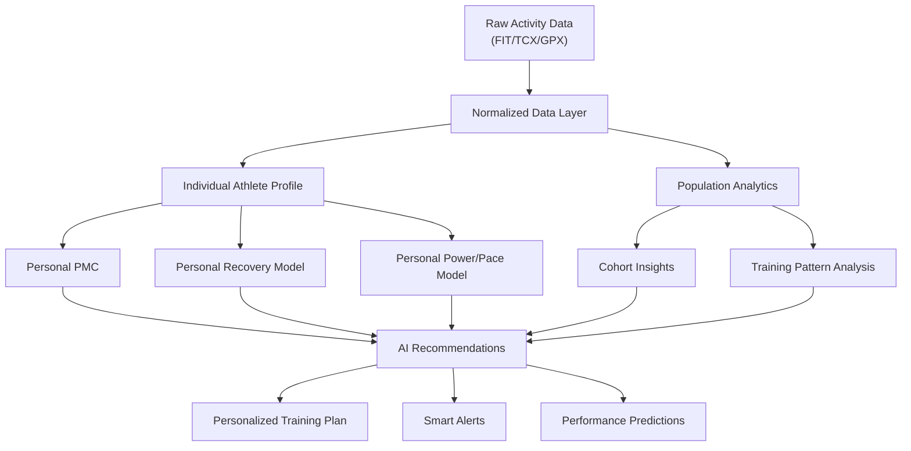
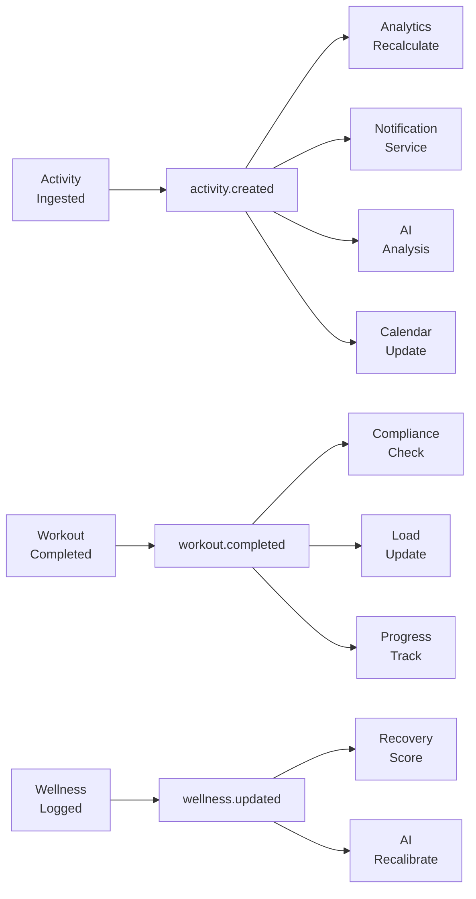

# The Operating System for Endurance Athletes
## Strategic Product Analysis & Go-to-Market Playbook

> **Perspective:** Product Strategist + UX Researcher + Founder
> **Target:** Build a modern, API-first, AI-native endurance platform that starts by competing with Intervals.icu, then scales to challenge TrainingPeaks

---

# 1. Pain Points Chi Tiết Của Intervals.icu

## 1.1 UX — "Built by an Engineer, for Engineers"

Intervals.icu là một **marvel of engineering** nhưng là một **UX anti-pattern textbook**.

| Vấn đề | Mức độ | Impact |
|---|---|---|
| Information overload trên mọi màn hình | 🔴 Critical | User mới bỏ cuộc trong 5 phút đầu |
| Không có visual hierarchy rõ ràng | 🔴 Critical | Mắt không biết nhìn đâu trước |
| Typography monotone, font size đồng nhất | 🟡 Medium | Mọi thứ trông "equal importance" |
| Color palette thiếu semantic meaning | 🟡 Medium | Data không "speak for itself" |
| Interactive elements thiếu affordance | 🟡 Medium | User không biết cái gì click được |
| Feedback loop yếu (save, sync, action) | 🟠 High | User không chắc action đã thành công chưa |

**Insight thật sự:** Intervals.icu vi phạm nguyên tắc cơ bản nhất của UX — *"Don't make me think."* Mỗi lần mở app, user phải **actively decode** thay vì **passively absorb**.

## 1.2 Information Architecture — Flat & Fragmented

```
Vấn đề IA cốt lõi:
┌──────────────────────────────────┐
│  Dashboard = Everything dump     │
│  ┌──────┐ ┌──────┐ ┌──────┐    │
│  │Chart1│ │Chart2│ │Chart3│    │
│  └──────┘ └──────┘ └──────┘    │
│  ┌──────┐ ┌──────┐ ┌──────┐    │
│  │Table1│ │Table2│ │Widget│    │
│  └──────┘ └──────┘ └──────┘    │
│  (tất cả cùng level, ko hierarchy)│
└──────────────────────────────────┘
```

- **Không có clear mental model:** User không biết "tôi đang ở đâu trong app"
- **Navigation structure flat:** Menu items quá nhiều, không grouped theo workflow
- **Context switching liên tục:** Từ dashboard → activity → settings → back, mỗi lần là "reset" cognitive context
- **Không có "progressive disclosure":** Beginner và expert thấy cùng UI, cùng complexity
- **Search/discovery yếu:** Tìm một setting cụ thể = đào bới menu

## 1.3 Dashboard — "Wall of Numbers"

Dashboard hiện tại của Intervals.icu:
- PMC chart (CTL/ATL/TSB) chiếm diện tích lớn nhưng **context thiếu** — số liệu ko kèm insight
- Fitness/Fatigue numbers hiện raw, **không có interpretation** ("81 CTL" nghĩa là gì cho tôi?)
- Weekly volume summary có nhưng **buried** trong noise
- **Không có "Today's Focus"** — athlete mở app không biết hôm nay nên làm gì
- **Không có emotional reward** — không celebration khi đạt milestone, không encouragement khi mệt
- Customizable nhưng customization process phức tạp

**So sánh mental model:**
```
Intervals.icu Dashboard:        vs     Ideal Athlete Dashboard:
"Đây là TẤT CẢ data của bạn"          "Hôm nay bạn nên nghỉ ngơi"
"Tự đọc đi"                            "Tuần này bạn đang on track"  
"27 charts, have fun"                   "Next workout: 2h Easy Ride"
                                        "Trend: Fitness ↑ +5% vs last month"
```

## 1.4 Mobile Experience — Essentially Non-existent

- **Không có native app** — chỉ là web responsive
- Charts co lại thành **unreadable** trên mobile
- Workout text syntax **impossible to type** trên phone keyboard
- Calendar view trên mobile = **unusable mess**
- **Critical miss:** 80%+ thời gian athlete interact với training data là trên phone (trước/sau workout)
- Competitor TrainingPeaks có mobile app (dù cũng chưa tốt), Strava có mobile-first experience tuyệt vời

> **Key insight:** Trong endurance sports, mobile experience quyết định daily engagement. Athlete check phone ngay sau workout, trước khi ngủ, sáng sớm. Desktop experience chỉ cho weekly review.

## 1.5 Workflow Tạo Workout — "Learn My Syntax"

```
Ví dụ workout syntax của Intervals.icu:
- 15m @55%FTP
- 3x(10m @90%FTP, 5m @55%FTP)  
- 20m @85-90%FTP
- 10m @50%FTP
```

**Pros:** Rất powerful, compact, precise
**Cons:**
- **Barrier to entry cực cao** — phải học "ngôn ngữ" mới
- Không có visual builder (drag-and-drop blocks)
- Không có template suggestion based on athlete's level/goal
- Lỗi syntax = workout hỏng, không có good error messages
- **Swim workouts đặc biệt phức tạp** (stroke type, equipment, drills)
- Không có preview visualization trước khi save
- Không có AI suggestion ("based on your fitness, today's workout should be...")

## 1.6 Calendar Experience

- Calendar **functional nhưng cluttered** khi có nhiều events
- **Drag-and-drop tồn tại** nhưng finicky, đặc biệt trên trackpad
- **Không có smart scheduling** — không warning khi schedule quá nhiều intensity liên tiếp
- **Không có rest day intelligence** — không suggest rest based on fatigue
- **Plan vs Actual gap visualization yếu** — khó thấy mình có follow plan không
- **Multi-week view** tốt cho planning nhưng **daily view thiếu detail**
- Recurring workouts setup phức tạp

## 1.7 Data Visualization

**Paradox:** Intervals.icu có **quá nhiều** visualization nhưng **quá ít insight.**

- Charts phong phú nhưng **default configurations suboptimal**
- Quá nhiều chart types = analysis paralysis
- **Không có "smart chart"** tự highlight anomaly/trend
- Power curve chart tốt nhưng **thiếu context** ("so với 3 tháng trước thì sao?")
- **Color coding inconsistent** across different charts
- **No storytelling:** Data không tell a story, chỉ present raw numbers
- **Comparisons khó:** So sánh 2 giai đoạn training đòi hỏi nhiều clicks

## 1.8 Athlete Onboarding — "Figure It Out Yourself"

- **Không có guided setup wizard**
- **Không hỏi mục tiêu/level** khi sign up
- User sign up → thấy empty dashboard phức tạp → **bounce**
- **Không có tutorial, tooltips, or contextual help**
- Zone setup require knowledge about FTP, LTHR, etc. — **beginner không biết**
- **First-time experience = worst experience** — ngược với mọi best practice
- Phải tự connect Garmin/Strava, tự configure — no hand-holding

## 1.9 Coach Workflow

- Coach dashboard **functional nhưng primitive**
- **Quản lý nhiều athlete = table of names**, không có at-a-glance health/compliance view
- **Không có communication hub** — coach phải dùng WhatsApp/email bên ngoài
- **Không có payment/invoicing** integration
- **Plan template sharing** tồn tại nhưng crude
- **Không có coach marketplace** — coach không thể monetize expertise on-platform
- **Athlete progress reporting** đòi hỏi coach manually review charts
- **Không có alert system** khi athlete skip workout hoặc có anomaly

## 1.10 Notification System — Nearly Absent

- **Không có push notification** (không có native app)
- Email notification rất basic
- **Không có smart alerts:** 
  - "Your HRV dropped 20% — consider rest"
  - "You've been overtraining for 3 days"
  - "Tomorrow's workout might be too hard based on today's fatigue"
  - "Congratulations! New power PR"
- **Không có daily briefing** ("Good morning, here's your training day")
- Passive platform — user phải chủ động đến, platform không proactively engage

## 1.11 Multi-Sport Experience

- Supports swim/bike/run/strength nhưng **cycling-biased**
- **Swim analysis thiếu chiều sâu** (no stroke analysis, no CSS tracking UI)
- **Brick workout** (bike→run) logging awkward
- **Transition tracking** cho triathlon nonexistent
- **Race simulation planning** không có
- **Cross-sport fatigue modeling** basic — simple TSS addition across sports
- Power users phải self-calculate swim TSS, run TSS differently

## 1.12 Sync Reliability Perception

- Sync **thực tế khá reliable** nhưng **perception** là unreliable vì:
  - Không có real-time sync status indicator
  - Delay không được communicated ("syncing... 2 minutes ago")
  - Khi sync fail, error message obscure
  - **Duplicate activities** xuất hiện occasionally, gây confusion
  - Garmin sync đôi khi chậm do Garmin API limitations, nhưng user blame Intervals.icu

## 1.13 Emotional Experience — "Tool, Not Companion"

Đây là **pain point ngầm nhưng sâu nhất:**

- Platform cảm giác như **spreadsheet phức tạp**, không như personal training companion
- **Không có dopamine loop:** Không gamification, không achievements, không streaks (theo cách meaningful)
- **Không celebrate progress** — đạt FTP mới, đạt distance PR = just another data point
- **Không có empathy trong design** — khi athlete mệt, injured, hay demoralized, platform vẫn cold
- **Không có personality** — tone of voice purely technical
- So sánh với Strava: mỗi lần hoàn thành run = kudos, comments, social validation → dopamine
- Intervals.icu = finish workout → see more numbers → feel nothing

> **The fundamental emotional gap:** Intervals.icu treats athletes as **data generators**, not as **humans on a journey.**

---

# 2. Vì Sao Intervals.icu Vẫn Mạnh Dù UX Khó Dùng

## 2.1 "Miễn phí" Là Rào Cản Vượt Qua Cực Khó

```
TrainingPeaks Premium: $20/tháng = $240/năm
Intervals.icu:         $0 (hoặc $3-4/tháng supporter)
                       
Khoảng cách giá: ~$200+/năm
```

Đối với athlete tự tập (self-coached) — chiếm **70%+ endurance athletes** — chi $240/năm cho software là **hard sell** khi có alternative miễn phí đủ tốt.

**Switching cost tâm lý:** "Tại sao trả tiền khi cái free đã cho tôi 90% features?"

## 2.2 API Openness — The Real Moat

Đây là **lý do thật sự** khiến power users (như bạn) trung thành:

| Platform | API Read | API Write | Workout Push | Free API | 
|---|---|---|---|---|
| Intervals.icu | ✅ Full | ✅ Full | ✅ Garmin/Wahoo | ✅ |
| TrainingPeaks | 🟡 Limited | 🟡 Limited | ✅ Most devices | ❌ Paid |
| Garmin Connect | 🔴 Restricted | 🔴 Very restricted | N/A (source) | ❌ Partner only |
| Strava | 🟡 Rate-limited | 🔴 Activities only | ❌ | ✅ (limited) |
| COROS | 🔴 Minimal | 🔴 Minimal | ❌ | ❌ |

**Intervals.icu là platform DUY NHẤT** cho phép full read/write API access miễn phí. Điều này biến nó thành:
- **Bridge platform** giữa các ecosystem (chính xác use case của bạn)
- **Automation hub** cho tech-savvy athletes
- **Data warehouse** cho custom analysis
- **Integration backbone** cho các tool tự build

## 2.3 Switching Cost Thật Sự

Không phải data lock-in (data có thể export), mà là:

1. **Workflow lock-in:** User đã build workflow phức tạp qua API, automation, custom setup → migrate = rebuild từ đầu
2. **Knowledge lock-in:** Đã mất 20+ giờ học cách dùng → không muốn học lại
3. **Historical data context:** CTL/ATL/TSB chart có ý nghĩa chỉ khi có **history dài** → platform mới = reset history
4. **Zone/threshold calibration:** Đã tune zones, FTP history, weight history → migrate phức tạp
5. **"Good enough" inertia:** "Nó hoạt động, tại sao đổi?"

## 2.4 Data Depth Không Có Đối Thủ Ở Phân Khúc Free

Intervals.icu cung cấp level phân tích mà **không có platform miễn phí nào khác match:**

- Advanced power curve analysis
- Custom interval detection
- Multi-sport PMC
- HR drift analysis  
- Pace decoupling
- VO2max estimation
- Season comparison
- Workout compliance analysis

Competitor miễn phí gần nhất (Final Surge, Strava) **thiếu 60-70%** depth này.

## 2.5 Endurance Power-User Psychology

Dân endurance sports (đặc biệt triathlon) có **psychological profile đặc biệt:**

- **Data-obsessed:** Sẵn sàng chịu UX tệ để có thêm data
- **Self-coached majority:** 70%+ tự tập, cần tools phân tích
- **Optimization mindset:** Luôn tìm cách optimize, sẵn sàng học tool phức tạp
- **Cost-conscious:** Chi tiền cho gear (bike $5K+, watch $500+) nhưng **penny-pinching trên software**
- **DIY mentality:** Thích tự tìm hiểu, build workflow riêng
- **Endurance = patience:** Sẵn sàng invest thời gian learn complex tool

> **Insight:** Intervals.icu tồn tại vì target user của nó có **pain tolerance cực cao** cho bad UX và **budget thấp** cho software. Đây là segment rất trung thành nhưng **rất khó monetize.**

## 2.6 Single Developer = Feature Velocity Paradox

David Tinker (creator) release features **nhanh hơn teams lớn** vì:
- Không có bureaucracy, committees, or approval process
- Direct user feedback → feature trong tuần
- Passionate about the domain
- Community-driven development

Nhưng đây cũng là **weakness:** Single point of failure, no QA, no design review, no UX research.

---

# 3. Opportunity Cực Lớn Trên Thị Trường

## 3.1 The Great Gap — Khoảng Trống Khổng Lồ

```
Market Map (User Sophistication vs UX Quality):

UX Quality ↑
     │
  ●  │ Strava (social-first,         
     │  no structured training)        
     │                                  ← THE GAP
     │                         ● Garmin Connect
     │                           (device companion,
     │                            not training platform)
     │
     │           ● TrainingPeaks (functional but dated)
     │           ● TrainerRoad (cycling niche)
     │
     │  ● Athletica.ai (AI but immature UX)
     │
     │                              ● Intervals.icu
     │                                (deep but terrible UX)
     └──────────────────────────────────→ Data Depth / Feature Depth
          Beginner                    Advanced
```

**The Gap:** Không có platform nào vừa có **modern UX** vừa có **serious training depth** vừa **multi-sport** vừa **affordable.**

## 3.2 Tại Sao TrainingPeaks Nhìn "Legacy"

- **UI thiết kế ~2015** và chưa major redesign
- **Pricing model cũ:** $20/month cho athlete khi market expectation đã shift
- **Không có AI features** — trong khi AI là table stakes cho 2025+
- **Innovation speed chậm** — corporate ownership (Peaksware) = bureaucracy
- **Mobile app mediocre** — mixed reviews, performance issues
- **Coach-focused culture** đang limit athlete-direct growth
- **API restrictive** hơn Intervals.icu
- **Vendor lock-in perception** cao

> **TrainingPeaks giống Microsoft Office 2010:** Vẫn works, vẫn standard, nhưng **ripe for disruption** bởi một Notion/Figma-like challenger.

## 3.3 Vì Sao Garmin Connect Không Đủ

- **Device companion, không phải training platform** — designed to mirror device data
- **Cross-device impossible:** Bạn có Garmin watch + Wahoo bike computer? Garmin Connect chỉ thấy Garmin data
- **API đóng:** Không cho third-party innovation
- **Analytics nông:** Không có PMC, không có advanced power analysis
- **No coach features:** Không có coach-athlete workflow
- **Multi-sport analysis yếu:** Triathlon experience fragmented
- **Vendor lock-in tối đa:** Designed to sell more Garmin hardware

## 3.4 Vì Sao Strava Không Giải Quyết Structured Training

Strava là **Instagram cho athletes** — brilliant ở social, **zero ở training:**

- Không có workout builder
- Không có training calendar
- Không có structured plans
- Không có training load management
- Không có zone-based analysis depth
- Fitness & Freshness (PMC equivalent) đã bị đơn giản hóa và đưa vào paid tier

**Strava chose social over training** — và đó là strategic choice đúng cho họ, nhưng tạo gap cho chúng ta.

## 3.5 Vì Sao AI Coach Hiện Tại Chưa Đủ Tốt

| Platform | AI Capability | Limitation |
|---|---|---|
| Athletica.ai | Full AI plan generation | Plans feel generic, limited personalization |
| TrainerRoad Adaptive | Adjusts cycling workouts | Cycling only, basic adaptation |
| Garmin Coach | Adaptive running plans | Running only, simplistic |
| Humango | AI triathlon coaching | Immature, small user base |

**Vấn đề chung của AI coaching hiện tại:**

1. **"AI" thường chỉ là rule-based system** gắn label AI
2. **Black box:** Athlete không hiểu TẠI SAO AI suggest workout đó → không trust
3. **Context-blind:** Không integrate life stress, sleep quality, travel, injury history
4. **One-size periodization:** Chưa truly personalize block periodization
5. **No real-time adaptation:** Plan set rồi chạy, không adjust giữa chừng
6. **Training science credibility gap:** Athletes nghi ngờ AI hiểu training science sâu
7. **Data quality problem:** Wrist-based HRV, sleep data noisy → AI decisions based on noisy input

**Opportunity:** AI coach mà **explainable** (giải thích reasoning), **contextual** (tích hợp life data), và **collaborative** (coach + AI hybrid) chưa tồn tại.

---

# 4. Nếu Build Đối Thủ Mới

## 4.1 Core Positioning

> **"EnduranceOS — The intelligent hub where your training comes together."**

**Positioning triangle:**

```
                    AI Intelligence
                         △
                        / \
                       /   \
                      /     \
                     / ENDO  \
                    /   OS    \
                   /           \
                  /             \
                 △───────────────△
           Beautiful UX        Open Ecosystem
           (Strava-level)      (Intervals.icu-level API)
```

**Không chọn 1, chọn cả 3** — đây là cách differentiate:
- Strava có UX nhưng thiếu depth
- Intervals.icu có depth nhưng thiếu UX
- TrainingPeaks có neither UX nor innovation
- Chưa ai có AI thật sự tốt

**Taglines tiềm năng:**
- *"Train smarter, not harder. All your data, one beautiful place."*
- *"Where data meets simplicity."*
- *"Your training, unified and intelligent."*

## 4.2 MVP Hợp Lý — "The Smart Calendar"

> **MVP không phải rebuild Intervals.icu. MVP là giải quyết MỘT workflow tốt hơn bất kỳ ai.**

### MVP = Intelligent Training Calendar + Unified Sync

**Core features cho MVP:**

```
Phase 1 MVP (3-4 months):
├── 🔗 Unified Sync Engine
│   ├── Garmin auto-sync (via Strava webhook initially)
│   ├── Strava auto-sync  
│   ├── Manual FIT/TCX upload
│   └── Sync status dashboard (real-time)
│
├── 📅 Smart Training Calendar
│   ├── Clean weekly/monthly view
│   ├── Planned vs Completed visualization
│   ├── Drag-and-drop workout scheduling
│   ├── AI-suggested rest days (basic, based on training load)
│   └── Mobile-first design
│
├── 💪 Visual Workout Builder
│   ├── Drag-and-drop block builder (NOT text syntax)
│   ├── Power/HR/Pace targets per block
│   ├── Workout templates library
│   ├── Export to Garmin (via .FIT)
│   └── Quick workout from template
│
├── 📊 Simple Dashboard  
│   ├── Today's workout + athlete status
│   ├── Weekly training load summary (visual bar)
│   ├── Fitness trend (simplified PMC)
│   ├── Recent activities feed
│   └── "How are you feeling?" daily check-in
│
├── 🔌 API (from Day 1)
│   ├── RESTful API for all data
│   ├── Webhook support
│   ├── API key auth
│   └── Good documentation
│
└── 📱 Mobile Web (PWA, optimized)
    ├── Calendar view
    ├── Today's workout
    ├── Quick activity view
    └── Daily check-in
```

**Tại sao "Smart Calendar" là MVP đúng:**
1. Calendar là **daily touchpoint** — user mở app mỗi ngày để check workout
2. Intervals.icu calendar UX là **one of its weakest points**
3. TrainingPeaks calendar **đắt ($20/mo)** — free alternative với better UX = instant appeal
4. Calendar + sync = **minimum viable value** cho endurance athlete
5. Visual workout builder giải quyết **biggest UX pain point** của Intervals.icu

## 4.3 Wedge Strategy — Hút User Từ Intervals.icu

### Target: "Frustrated Power Users"

Không nhắm **tất cả** Intervals.icu users. Nhắm nhóm cụ thể:

**Primary wedge user:** *Self-coached triathlete, 2-5 năm experience, dùng Intervals.icu hàng ngày, frustrated với UX, tech-savvy đủ để try new tool, active in community forums.*

### Wedge tactics:

1. **"Import from Intervals.icu" button** — One-click migration:
   - Import full activity history
   - Import zones, FTP history
   - Import workout library
   - Import training calendar
   - **Giảm switching cost xuống gần 0**

2. **Intervals.icu API bridge mode:**
   - Dùng CHÍNH Intervals.icu API để sync data
   - User có thể dùng EnduranceOS như **beautiful frontend** cho Intervals.icu data
   - Giảm risk "all or nothing" switch
   - *"Use our UX, keep your data where it is"*

3. **Side-by-side period:** Cho phép user chạy cả 2 platform song song, data sync both ways
   
4. **Community targeting:**
   - Post trên r/triathlon, r/cycling, Intervals.icu forum
   - "We love Intervals.icu's data. We built a better way to experience it."
   - Positioning = **complement, not replacement** (initially)

5. **Free tier matches Intervals.icu:** Core features MUST be free. Premium = AI features + advanced analytics

### Viral loop:
```
Athlete uses EnduranceOS → Creates workout → Shares plan link → 
Friend clicks → Signs up → Imports their data → Repeat
```

## 4.4 Features KHÔNG Nên Build Giai Đoạn Đầu

| Feature | Lý do skip |
|---|---|
| Coach marketplace | Chicken-and-egg, cần scale trước |
| Payment/invoicing cho coach | Complexity cao, low initial demand |
| Social features (kudos, feed) | Strava already won, đừng compete here |
| Route planning | Komoot/Strava đã solved, not core value |
| Live tracking | Nice-to-have, not MVP |
| Hardware integrations (direct Garmin API) | Cần partnerships, takes 6-12 months |
| White-label | Enterprise feature, quá sớm |
| Native mobile app | PWA first, native khi có traction |
| Race prediction | Accuracy risk, credibility risk |
| Nutrition tracking | Scope creep, nhiều competitor |
| Video analysis (swim/run form) | Deep tech, separate product |

## 4.5 Features Tạo Moat Dài Hạn

### 1. Unified Sync Engine (Technical Moat)
- Kết nối **mọi** ecosystem: Garmin, COROS, Wahoo, Polar, Suunto, Zwift, ROUVY, TrainerRoad
- Handle deduplication, conflict resolution, format normalization
- **Moat vì:** Mỗi integration cần maintain, test, update — cumulative advantage

### 2. Workout Normalization Layer (Data Moat)
- Chuẩn hóa workout format across ALL platforms
- Internal universal workout format → export to FIT, ZWO, TrainingPeaks, etc.
- **Moat vì:** Trở thành "USB-C of workouts" — standard interchange

### 3. AI Training Intelligence (Intelligence Moat)
- Not just "AI generates workout"
- **AI understands your training CONTEXT:**
  - Historical response to training loads
  - Personal recovery patterns
  - Performance progression model
  - Life stress integration
  - Multi-sport fatigue interaction
- **Moat vì:** More data → better AI → more trust → more users → more data (flywheel)

### 4. Athlete Data Graph (Network Moat)
- Cross-athlete anonymized patterns: "Athletes similar to you improved by doing X"
- Population-level insights → personal recommendations
- **Moat vì:** Network effect — mỗi user mới improve AI cho tất cả users

### 5. Open API Ecosystem (Platform Moat)
- Richer API than Intervals.icu
- Developer marketplace: third-party apps built on your data
- **Moat vì:** App ecosystem creates stickiness (like Salesforce AppExchange)

---

# 5. Phân Tích Chiến Lược Sản Phẩm

## 5.1 API-First Strategy

> **"API is the product. UI is one client of the API."**

### Principles:
1. **Every feature available via API** — no "UI-only" features
2. **API documentation as marketing** — beautiful docs (like Stripe)
3. **Webhook system** cho real-time events: activity.created, workout.completed, zone.changed
4. **Rate limiting generous** cho free tier — differentiate from Garmin/TP
5. **SDK packages** (Python, JS, Swift) cho developer community
6. **API versioning** from day 1 — don't break integrations

### Why API-first wins:

```
Developer builds integration → Users discover platform through integration 
→ Users bring more developers → Network effect
```

**Precedent:** Stripe didn't win on pricing. They won on **developer experience.** 
Your API should be the "Stripe of fitness data."

### API Monetization (later):
- Free tier: 1000 requests/day, personal use
- Pro tier: 10K requests/day, commercial use, $29/month  
- Enterprise: unlimited, SLA, dedicated support

## 5.2 Athlete Data Graph



**Athlete Data Graph concept:**
- Mỗi athlete = node với properties (FTP, LTHR, training history, recovery patterns, race results)
- Connections: athlete-to-workout, athlete-to-equipment, athlete-to-race, athlete-to-similar-athletes
- Enable: "Athletes with similar profiles who trained for Ironman gained most from X approach"
- Privacy-first: all cross-athlete insights anonymized and aggregated

## 5.3 AI Workout Generation — "Not Another AI Coach"

### Approach khác biệt:

**AI Coach hiện tại:** "Here's your workout for today" (black box)

**EnduranceOS AI:** "Here's today's suggested workout, and here's WHY"

```
┌─────────────────────────────────────────────┐
│ 🧠 Today's Suggestion                       │
│                                              │
│ 🚴 Zone 2 Endurance Ride — 2h00             │
│                                              │
│ Why this workout?                            │
│ ├── Your CTL is 72, trending up ✅           │
│ ├── Yesterday's intensity was high (IF 0.92) │  
│ ├── HRV this morning: -8% vs baseline ⚠️    │
│ ├── You have a race in 3 weeks              │
│ └── Periodization: currently in Build Phase  │
│                                              │
│ 💡 You could also:                           │
│ ├── Easy Run (45min) if you prefer running   │
│ ├── Rest Day if feeling fatigued             │
│ └── Modify intensity ↕                       │
│                                              │
│ [Accept] [Modify] [Replace] [Skip Today]     │
└─────────────────────────────────────────────┘
```

### Key AI differentiators:
1. **Explainable:** Always show reasoning
2. **Collaborative:** Athlete has final say, AI learns from choices
3. **Multi-modal context:** Integrates HRV, sleep, wellness, training load, upcoming events
4. **Multi-sport aware:** Understands brick workouts, sport-specific fatigue
5. **Periodization-intelligent:** Understands macro/meso/micro cycle planning
6. **Coach-compatible:** AI suggests, coach approves/modifies workflow

## 5.4 AI Fatigue/Recovery Analysis

```
Daily Recovery Score:
┌─────────────────────────────────┐
│ Recovery Status: 72/100 🟡       │
│                                  │
│ Factors:                         │
│ ├── Sleep: 7.2h (good) ✅       │
│ ├── HRV: 52ms (-12%) ⚠️        │
│ ├── Yesterday's load: 145 TSS   │
│ ├── 3-day load trend: ↑ heavy   │
│ ├── Resting HR: +4 bpm ⚠️      │
│ └── Self-reported: "tired legs" │
│                                  │
│ Recommendation: Light day        │
│ Confidence: 78%                  │
└─────────────────────────────────┘
```

**Cách build mà các competitor chưa làm được:**
- Combine **objective data** (HRV, HR, training load) with **subjective data** (mood, fatigue, soreness)
- **Learn individual patterns** over time: "When YOUR HRV drops 10%, you typically need 2 rest days"
- **Predict future fatigue** based on upcoming schedule
- **Alert system:** Proactive warnings, not just reactive data

## 5.5 Training Load Intelligence

Vượt qua PMC truyền thống:

| Feature | Traditional PMC | EnduranceOS Intelligence |
|---|---|---|
| Metric | TSS/day | Multi-dimensional load (power, HR, duration, sport) |
| Time constants | Fixed (42/7 days) | **Personalized** based on individual response |
| Sport interaction | Simple addition | **Sport-specific fatigue models** |
| Acute:Chronic ratio | Static threshold | **Personalized injury risk zones** |
| Visual | Line chart | **Contextual dashboard** with zones, events, annotations |
| Actionability | "TSB = -15" (so what?) | "You're 2 days from optimal form for your race" |

## 5.6 Unified Endurance Inbox

**New concept — "Morning Briefing":**

```
┌──────────────────────────────────────────┐
│ ☀️ Good morning, Anh! — Wednesday        │
│                                           │
│ 📊 Status: Fitness ↑ 73 | Fatigue 58     │
│ 🟢 Form: +15 (Great shape!)              │
│                                           │
│ 🏋️ Today's Plan:                         │
│ 🚴 Tempo Ride — 1h30 — 3x15min @88%FTP  │
│ [Start Workout] [Modify] [Skip]           │
│                                           │
│ 📩 Updates:                               │
│ ├── ✅ Yesterday's ride synced from Garmin│
│ ├── ⚡ New FTP detected: 265W (+5W!)     │
│ ├── 📈 Weekly volume: 8h/12h planned     │
│ └── 🏁 Race in 18 days: IRONMAN 70.3     │
│                                           │
│ 💤 Recovery note:                         │
│ HRV: 54ms (normal range)                 │
│ Sleep: 7.5h (good quality)               │
│                                           │
└──────────────────────────────────────────┘
```

**Đây là "one screen to rule them all"** — giải quyết cognitive load problem bằng cách curate information thay vì dump all data.

## 5.7 Multi-Platform Sync Engine

```
Architecture:
                    ┌────────────────────┐
                    │    Sync Engine      │
                    │  (Event-Driven)     │
                    └─────────┬──────────┘
                              │
            ┌─────────────────┼─────────────────┐
            │                 │                 │
     ┌──────▼──────┐  ┌──────▼──────┐  ┌──────▼──────┐
     │  Ingest     │  │  Process    │  │  Distribute  │
     │  Workers    │  │  Pipeline   │  │  Workers     │
     └──────┬──────┘  └──────┬──────┘  └──────┬──────┘
            │                │                 │
    ┌───────┼───┐     ┌──────┼──────┐     ┌───┼───────┐
    │ Garmin    │     │Normalize    │     │ Push to   │
    │ Strava    │     │Deduplicate  │     │ Garmin    │
    │ COROS     │     │Enrich       │     │ Wahoo     │
    │ Wahoo     │     │Validate     │     │ Calendar  │
    │ Polar     │     │Store        │     │ Export    │
    │ Zwift     │     └─────────────┘     └───────────┘
    │ ROUVY     │
    │ File Upload│
    └────────────┘
```

**Key engineering decisions:**
1. **Webhook-first, polling-fallback** cho mỗi source
2. **Idempotent processing** — same activity arrives 3x = stored 1x
3. **Source-of-truth hierarchy:** FIT file > Garmin > Strava > manual
4. **Eventual consistency model** — sync may be delayed, UI shows status
5. **Vendor abstraction layer** — each vendor = adapter, core logic vendor-agnostic

---

# 6. Phân Tích UX Strategy

## 6.1 Dashboard Philosophy — "Contextual Intelligence, Not Data Dump"

### Principles:

1. **Start with "WHY" not "WHAT"**
   - ❌ "CTL: 72, ATL: 58, TSB: +14"  
   - ✅ "You're in great shape — ready for hard training"

2. **Time-relevant hierarchy:**
   - Morning: Today's workout + recovery status
   - Post-workout: Activity analysis + compliance
   - Evening: Tomorrow's preview + weekly summary
   - Weekend: Weekly review + next week planning

3. **Three-level depth:**
   ```
   Level 1: Glance (5 seconds)     → Status emoji + one sentence
   Level 2: Understand (30 seconds) → Key metrics + trend + today's plan  
   Level 3: Analyze (5+ minutes)    → Full charts, details, comparisons
   ```

4. **One primary action per screen** — what should user DO right now?

## 6.2 Progressive Disclosure — "Simple Until You Need Complex"

```
Layer 0 — Dashboard:
├── "You're fit, slightly fatigued. Easy day recommended."
├── [See today's workout]
│
Layer 1 — Expanded view:
├── Fitness: 72 (+3 this week)
├── Fatigue: 58 (decreasing ✓)
├── Weekly load: 650 TSS / 800 planned
├── [Show detailed chart]
│
Layer 2 — Full analytics:
├── PMC Chart (interactive)
├── Power curve overlay
├── Zone distribution
├── Custom analysis builder
└── [Expert mode: raw data export]
```

**Implementation:**
- **Default = Simple.** Every user starts with clean, minimal view
- **Expand on demand.** Tap/click to reveal more detail
- **Remember preferences.** If user always expands PMC, default to expanded
- **Smart defaults.** Show different metrics based on sport, time of day, training phase
- **"Expert mode" toggle.** Power users can permanently unlock all detail

## 6.3 Adaptive UI — "The UI That Learns You"

### Adaptation dimensions:

| Dimension | Beginner | Intermediate | Advanced |
|---|---|---|---|
| Metrics shown | Duration, distance, HR zones | + TSS, IF, power zones | + NP, VI, Pw:Hr, custom |
| Chart complexity | Simple bar/line | + PMC, zone distribution | + power curve, HR drift, custom |
| Workout creation | Template picker | Template + modifier | Full builder + text syntax |
| Terminology | "Easy", "Hard", "Long" | Zone numbers | Power %, specific metrics |
| AI explanation | "Take it easy today" | "TSB suggests recovery" | "CTL/ATL ratio indicates..." |

### How it adapts:
1. **Onboarding survey:** "How experienced are you?" + "What sports do you do?"
2. **Usage patterns:** If user never clicks advanced charts → hide them
3. **Explicit preference:** "I want to see more/less detail" toggle
4. **Gradual unlock:** As user engages more, suggest advanced features ("Did you know you can track power zones?")

## 6.4 Mobile-First Endurance Workflow

> **80% of daily athlete-app interaction is on mobile.** Design for mobile first.

### Key mobile workflows:

**Pre-workout (Morning, 60 seconds):**
```
┌────────────────────────┐
│ Good morning, Anh! 🌅   │
│                         │
│ Recovery: 82/100 🟢     │
│ Today: Tempo Run 45min  │
│                         │
│ [▶ Start] [View Details]│
│                         │
│ How do you feel?        │
│ 😫 😐 🙂 😊 🤩         │
└────────────────────────┘
```

**Post-workout (2 minutes):**
```
┌────────────────────────┐
│ Great run! 🎉           │
│                         │
│ ⏱ 47:23  📏 8.2km      │
│ ❤️ Avg 152  ⚡ Pace 5:47│
│                         │
│ 🎯 Plan compliance: 92% │
│ 📈 Fitness trend: ↑     │
│                         │
│ Highlight: New 5K PR!   │
│ 🏆 19:45 (-0:32)       │
│                         │
│ [Details] [Share] [Next]│
└────────────────────────┘
```

**Evening review (30 seconds):**
```
┌────────────────────────┐
│ Tomorrow's Plan 📋      │
│                         │
│ 🚴 Easy Ride 1h30      │
│ Zone 2, flat route      │
│                         │
│ This week so far:       │
│ ████████░░░░ 65% done   │
│                         │
│ [Confirm] [Reschedule]  │
└────────────────────────┘
```

### Mobile design rules:
1. **One hand operable** — key actions within thumb reach
2. **Glanceable** — information parseable in 3 seconds
3. **Large touch targets** — minimum 44px
4. **Swipe navigation** — between days, between activities
5. **Offline capable** — today's workout available offline
6. **Quick actions** — mark workout done, rate feeling, skip day

## 6.5 Dark Mode Design Strategy

> **Dark mode is NOT optional for endurance athletes.** Early morning and late evening are peak usage times.

### Design approach:
- **Dark mode = default** (user opts INTO light mode)
- **True black background** for OLED screens (#000000 base, not #1a1a1a)
- **Accent colors vibrant on dark:** Electric blue for fitness, warm amber for fatigue, emerald for form
- **Data visualizations redesigned for dark** — not just inverted
- **Reduced brightness charts** — easy on eyes at 5AM
- **Automatic switching** based on time of day or system preference

### Color system:
```
Dark Mode Palette:
├── Background: #000000 (true black)
├── Surface:    #0A0A0F (cards, panels)
├── Elevated:   #141420 (modals, popups)  
├── Border:     #1E1E2E (subtle separation)
├── Text Primary:   #E8E8ED
├── Text Secondary: #8B8B9E
│
├── Fitness:  #3B82F6 (blue)
├── Fatigue:  #F59E0B (amber)
├── Form:     #10B981 (emerald)
├── Danger:   #EF4444 (red)
├── Success:  #22C55E (green)
│
├── Power Zone 1: #60A5FA (light blue)
├── Power Zone 2: #34D399 (green)
├── Power Zone 3: #FBBF24 (yellow)
├── Power Zone 4: #FB923C (orange)
├── Power Zone 5: #F87171 (red)
├── Power Zone 6: #C084FC (purple)
└── Power Zone 7: #F472B6 (pink)
```

## 6.6 Data Density Strategy — "Dense But Clear"

> **The goal is NOT less data. The goal is ORGANIZED data.**

### Strategy: "Newspaper Layout"

Like a newspaper:
- **Headlines** = Key status, glanceable
- **Above the fold** = Most important metrics
- **Below the fold** = Supporting detail
- **Deep articles** = Full analysis pages
- **Consistent typography hierarchy** = H1 → H2 → H3 → body → caption

### Density levels:
```
Compact:    [●] 72 Fitness  [●] 58 Fatigue  [●] +14 Form
Standard:   Fitness: 72 ↑3  |  Fatigue: 58 ↓5  |  Form: +14 🟢
Expanded:   Full PMC chart with annotations, events, zones
```

### Tools for managing density:
1. **Collapsible sections** — expand only what you need
2. **Sparklines** — tiny inline charts for trends without taking space
3. **Tooltip depth** — hover for detail without navigating away
4. **Card-based layout** — each card = one concept, can be rearranged
5. **"Focus mode"** — hide everything except current analysis
6. **Keyboard shortcuts** — power users navigate without mouse

---

# 7. Phân Tích Business Strategy

## 7.1 Subscription Model

### Pricing philosophy: **"Free for individuals, paid for intelligence"**

```
┌──────────────┬────────────────┬──────────────────┬───────────────────┐
│              │ Free           │ Pro ($9/month)   │ Elite ($19/month) │
├──────────────┼────────────────┼──────────────────┼───────────────────┤
│ Sync         │ 2 sources      │ Unlimited        │ Unlimited         │
│ Calendar     │ ✅ Full        │ ✅ Full          │ ✅ Full           │
│ Workout      │ Templates      │ Full builder     │ Full + AI suggest │
│ Dashboard    │ Basic          │ Full             │ Full + custom     │
│ Analytics    │ 30 days        │ Full history     │ Full + comparisons│
│ AI Features  │ Basic insights │ AI weekly review │ Full AI coach     │
│ API          │ 500 req/day    │ 5000 req/day     │ 20000 req/day     │
│ Export       │ CSV            │ FIT/TCX/CSV      │ All + bulk        │
│ Sports       │ 2              │ Unlimited        │ Unlimited         │
│ Support      │ Community      │ Email            │ Priority          │
└──────────────┴────────────────┴──────────────────┴───────────────────┘
```

### Why $9 and $19 (not $3 like Intervals.icu or $20 like TrainingPeaks):

- **$9 is "Netflix cheap"** — affordable enough that serious athletes won't think twice
- **$19 is "gym membership"** — positioned as essential training tool, still 50% cheaper than TrainingPeaks
- **Free tier must be GENUINELY useful** — not crippled. This is your funnel.
- **AI is the paywall** — data is free, intelligence is paid. This aligns value with revenue.

### Revenue projection (conservative):
```
Year 1: 5K free + 500 Pro + 100 Elite = ~$6K MRR ($72K ARR)
Year 2: 30K free + 3K Pro + 500 Elite = ~$37K MRR ($444K ARR)  
Year 3: 100K free + 15K Pro + 2K Elite = ~$173K MRR ($2M ARR)
```

## 7.2 Coach Marketplace (Phase 2)

**Timing:** NOT in MVP. Build after 10K+ athlete user base.

### Model:
- Coaches get **free platform** to manage up to 5 athletes
- **Coach Pro: $29/month** — unlimited athletes, plan templates, athlete analytics
- **Marketplace commission:** 15% on plan sales (vs TrainingPeaks ~30%)
- **White-label training plans:** Coaches sell branded plans through your platform

### Why wait:
- Need athlete base first (chicken = athletes, egg = coaches)
- Coach features are complex and high-stakes (coach livelihood depends on reliability)
- Marketplace requires curation, review, dispute resolution infrastructure

## 7.3 B2B Cho Coach/Team

### Products:
- **Team Dashboard:** Coach manages 10-50+ athletes with at-a-glance compliance
- **Team Analytics:** Compare athletes, identify who needs attention
- **Communication Hub:** In-app messaging, workout comments, video feedback
- **Billing Integration:** Coach charges athletes through platform
- **Team Pricing:** $99-299/month based on team size

### Target customers:
- Professional triathlon coaches
- Running clubs / tri clubs
- Cycling teams
- University endurance programs
- Corporate wellness programs (endurance segment)

## 7.4 API Monetization

```
Free:       500 requests/day, personal use, basic endpoints
Developer:  $29/month — 10K req/day, all endpoints, webhooks
Business:   $99/month — 50K req/day, SLA, priority support
Enterprise: Custom — unlimited, dedicated instance, custom endpoints
```

**Revenue potential low initially** but creates ecosystem stickiness.
**Third-party integrations built on your API = switching cost for their users.**

## 7.5 White-Label Possibility (Phase 3+)

- Allow gyms, coaches, brands to white-label the calendar + workout experience
- Revenue: $500-2000/month per white-label instance
- Example: "Powered by EnduranceOS" for a triathlon coaching company
- **Wait until product is extremely stable** — white-label = reputation risk if buggy

## 7.6 Partnership Strategy

| Partner | Value to Them | Value to Us | Approach |
|---|---|---|---|
| **Garmin** | More structured workout users for Garmin devices | Direct workout push, activity sync | Apply for Training API partnership. Show user traction. |
| **COROS** | Growing platform, wants ecosystem | User growth in COROS segment | Early partnership pitch — COROS more open to new partners than Garmin |
| **Wahoo** | Compete with Garmin ecosystem | ELEMNT workout push | Via existing APIs, then deeper partnership |
| **Zwift** | Keep indoor cyclists engaged between rides | Indoor workout data, training plan sync | ZWO file export, then API integration |
| **ROUVY** | Growing platform, wants training integration | Indoor ride data, route-based workouts | Direct API partnership pitch |
| **Strava** | Keep as activity hub, not training competitor | Universal sync backbone | Strava API (existing, reliable) |

**Key insight:** Don't wait for partnerships. Build with available APIs (Strava, file upload) first. Partnerships come with **user traction as leverage.**

---

# 8. Phân Tích Technical Moat

## 8.1 Sync Engine Architecture

```
┌─────────────────────────────────────────────────────────────────┐
│                        SYNC ENGINE                               │
│                                                                  │
│  ┌──────────┐    ┌──────────────┐    ┌───────────────────────┐  │
│  │ Adapters  │───▶│ Event Queue  │───▶│ Processing Pipeline    │  │
│  │           │    │ (Kafka/SQS)  │    │                       │  │
│  │ ┌───────┐ │    └──────────────┘    │ 1. Parse (FIT/TCX/GPX)│  │
│  │ │Garmin │ │                        │ 2. Normalize           │  │
│  │ │Strava │ │                        │ 3. Deduplicate         │  │
│  │ │COROS  │ │                        │ 4. Enrich (zones,TSS) │  │
│  │ │Wahoo  │ │                        │ 5. Store               │  │
│  │ │Polar  │ │                        │ 6. Index               │  │
│  │ │Suunto │ │                        │ 7. Notify              │  │
│  │ │Manual │ │                        │                       │  │
│  │ └───────┘ │                        └───────────────────────┘  │
│  └──────────┘                                                    │
│                                                                  │
│  ┌──────────────────────────────────────────────────────────┐   │
│  │ State Management                                         │   │
│  │ ├── Source Registry (which sources connected)            │   │
│  │ ├── Sync Status (last sync time, pending, errors)       │   │
│  │ ├── Dedup Index (fingerprint → activity mapping)        │   │
│  │ └── Conflict Log (when sources disagree)                │   │
│  └──────────────────────────────────────────────────────────┘   │
└─────────────────────────────────────────────────────────────────┘
```

### Key design decisions:

1. **Event-driven, not batch:** Process each activity as it arrives
2. **Adapter pattern:** Each vendor = separate adapter module. Core engine is vendor-agnostic.
3. **Idempotent processing:** Same event processed N times = same result
4. **Activity fingerprint:** Hash of (device_id, start_time, sport_type, duration) for dedup
5. **Source priority hierarchy:** Original file > Device cloud > Strava > Manual
6. **Async by default:** Sync is eventual. UI shows "last synced: 2 min ago"

## 8.2 Event-Driven Architecture



**Benefits:**
- **Loosely coupled:** Services don't know about each other
- **Scalable:** Add new consumers without changing producers
- **Real-time:** Events processed as they happen
- **Auditability:** Event log = full system history

## 8.3 Workout Normalization

### Universal Workout Model:

```json
{
  "id": "uuid",
  "name": "Tempo Intervals",
  "sport": "cycling",
  "targetDuration": 5400,
  "steps": [
    {
      "type": "warmup",
      "duration": { "type": "time", "value": 900 },
      "target": { "type": "power", "zone": "z2" },
      "cadence": { "min": 85, "max": 95 }
    },
    {
      "type": "repeat",
      "count": 3,
      "steps": [
        {
          "type": "interval",
          "duration": { "type": "time", "value": 600 },
          "target": { "type": "power", "min": 0.88, "max": 0.92, "reference": "ftp" }
        },
        {
          "type": "recovery",
          "duration": { "type": "time", "value": 300 },
          "target": { "type": "power", "zone": "z1" }
        }
      ]
    },
    {
      "type": "cooldown",
      "duration": { "type": "time", "value": 600 },
      "target": { "type": "power", "zone": "z1" }
    }
  ],
  "exportFormats": ["fit", "zwo", "erg", "text"]
}
```

### Export adapters:
```
Universal Model → FIT Adapter → .fit file (for Garmin, Wahoo)
                → ZWO Adapter → .zwo file (for Zwift)
                → MRC Adapter → .mrc file (for indoor trainers)
                → Text Adapter → readable description
                → iCal Adapter → calendar event
```

## 8.4 FIT/TCX/GPX Parsing

### Architecture:
```
┌─────────────────────────────────────────────┐
│              File Parser Service             │
│                                              │
│  Input: Raw file (binary or XML)            │
│                                              │
│  ┌─────────┐  ┌──────────┐  ┌─────────┐   │
│  │FIT Parser│  │TCX Parser│  │GPX Parser│   │
│  │(SDK-based│  │(XML/SAX) │  │(XML/SAX) │   │
│  │streaming)│  └──────────┘  └─────────┘   │
│  └─────────┘                                │
│         │            │            │          │
│         ▼            ▼            ▼          │
│  ┌──────────────────────────────────────┐   │
│  │      Canonical Activity Model        │   │
│  │                                      │   │
│  │  - Metadata (sport, device, time)    │   │
│  │  - Streams[] (1s resolution)         │   │
│  │    - timestamp, lat, lon, alt       │   │
│  │    - heartrate, power, cadence      │   │
│  │    - speed, pace, temperature       │   │
│  │  - Laps[] (summaries)               │   │
│  │  - DeviceInfo                       │   │
│  │  - DeveloperFields[] (custom)       │   │
│  └──────────────────────────────────────┘   │
│                                              │
│  Output: Normalized, validated, enriched    │
└─────────────────────────────────────────────┘
```

**Key challenges:**
- FIT SDK updates frequently — need to track
- Edge cases in file parsing (corrupt files, missing data, timezone issues)
- Garmin-specific extensions in TCX/GPX
- Stream data alignment (timestamps may be irregular)
- Large file handling (6+ hour Ironman = millions of data points)

## 8.5 Vendor Abstraction Layer

```typescript
interface VendorAdapter {
  // Identity
  name: string;
  supportedSports: Sport[];
  
  // Auth
  authorize(userId: string): Promise<AuthResult>;
  refreshToken(token: string): Promise<AuthResult>;
  
  // Read
  getActivities(since: Date): Promise<Activity[]>;
  getActivityDetail(id: string): Promise<ActivityDetail>;
  getActivityFile(id: string): Promise<Buffer>;  // FIT/TCX
  
  // Write  
  pushWorkout(workout: UniversalWorkout): Promise<PushResult>;
  deleteWorkout(id: string): Promise<void>;
  
  // Sync
  registerWebhook(url: string): Promise<void>;
  handleWebhook(payload: any): Promise<SyncEvent>;
  
  // Capabilities
  capabilities(): VendorCapabilities;
  // e.g., { canPushWorkout: true, canReadHRV: false, ... }
}
```

**Implementations:**
```
VendorAdapter
├── GarminAdapter (Strava bridge + Garmin API when available)  
├── StravaAdapter (OAuth2, webhooks, activities)
├── COROSAdapter (limited, via Strava bridge initially)
├── WahooAdapter (OAuth2, activities, workout push)
├── PolarAdapter (AccessLink API)
├── SuuntoAdapter (Suunto App API)  
├── ZwiftAdapter (activity import, ZWO export)
├── ROUVYAdapter (activity import)
└── FileAdapter (FIT/TCX/GPX upload)
```

## 8.6 Conflict Resolution

```
Conflict Resolution Strategy:
┌──────────────────────────────────────────────┐
│                                               │
│  Same activity from multiple sources?         │
│                                               │
│  Step 1: Detect (fingerprint match)           │
│  Step 2: Merge (take best data from each)     │
│  Step 3: Resolve conflicts:                   │
│                                               │
│  Priority: FIT file > Device cloud > Strava   │
│                                               │
│  For each field:                              │
│  ├── If only one source has data → use it     │
│  ├── If sources agree → use either            │
│  ├── If sources disagree:                     │
│  │   ├── Numeric (power, HR): use highest-    │
│  │   │   fidelity source (FIT > calculated)   │
│  │   ├── GPS data: use most data points       │
│  │   ├── Metadata: use primary source         │
│  │   └── Log conflict for review              │
│  └── Store all sources for audit              │
│                                               │
└──────────────────────────────────────────────┘
```

## 8.7 Offline-First Sync

### For mobile PWA:
```
┌─────────────────────────────────────────────┐
│  Offline-First Architecture                  │
│                                              │
│  ┌──────────────┐    ┌───────────────────┐  │
│  │ Local Store   │    │ Sync Queue        │  │
│  │ (IndexedDB)   │    │ (pending actions) │  │
│  │               │    │                   │  │
│  │ - Today's     │    │ - Log wellness    │  │
│  │   workout     │    │ - Mark complete   │  │
│  │ - Recent      │    │ - Rate workout    │  │
│  │   activities  │    │ - Modify plan     │  │
│  │ - User zones  │    │                   │  │
│  │ - Calendar    │    │ When online:      │  │
│  │   (next 7d)   │    │ → Flush queue     │  │
│  └──────────────┘    │ → Pull updates    │  │
│                       └───────────────────┘  │
│                                              │
│  Service Worker: Background sync when        │
│  connection restored                         │
└─────────────────────────────────────────────┘
```

**Why offline matters:**
- Athletes train in areas with no cell service (mountains, remote roads)
- Need to see today's workout before heading out
- Post-workout logging shouldn't require internet
- Morning check-in (HRV, sleep, mood) must work offline

---

# 9. Phân Tích Realistic Risk

## 9.1 Risk Matrix

| Risk | Probability | Impact | Mitigation |
|---|---|---|---|
| Garmin closes API access | 🟡 Medium | 🔴 Critical | Strava bridge as fallback, file upload, diversify sources |
| COROS/Wahoo restrict API | 🟡 Medium | 🟡 Medium | Not dependent on single vendor |
| TrainingPeaks copies features | 🟢 Low | 🟡 Medium | Speed advantage, free tier, API openness |
| Intervals.icu improves UX | 🟡 Medium | 🟡 Medium | Move faster, broader vision, AI advantage |
| AI coach accuracy issues | 🔴 High | 🔴 Critical | Conservative AI, always explainable, easy override |
| User acquisition cost too high | 🟡 Medium | 🔴 Critical | Community-led growth, API ecosystem, word-of-mouth |
| Data privacy regulations | 🟡 Medium | 🟡 Medium | GDPR-first design, data ownership transparency |
| Training science credibility | 🔴 High | 🟠 High | Partner with sports scientists, publish methodology |
| Revenue model failure | 🟡 Medium | 🔴 Critical | Validate pricing early, keep costs low, bootstrap |
| Single founder burnout | 🔴 High | 🔴 Critical | Seek co-founder, pace yourself, automate ops |

## 9.2 API Bị Khóa — The Existential Risk

**Scenario:** Garmin tightens API access, Strava rate-limits heavily, you lose sync capability.

**Mitigation layers:**
1. **File upload always works** — FIT files are universal, athlete can manually upload
2. **Garmin Training API partnership** — once achieved, more stable than Strava bridge
3. **Multiple source redundancy** — never depend on single vendor
4. **Own device integration** — long-term, build Connect IQ app for direct device sync
5. **Community value** — even without auto-sync, if your analytics/AI are good enough, users will manually upload

**Precedent:** Intervals.icu survived by being valuable enough that Garmin partnered with them. Same path is available.

## 9.3 Vendor Dependency

**Rule:** No single vendor should be >40% of your user base's primary sync source.

**Diversification strategy:**
- Launch targeting Garmin AND COROS AND Wahoo users simultaneously
- Strava as universal fallback
- File upload as always-available option
- Build toward direct device partnerships

## 9.4 Training Science Credibility

**The problem:** Users trust coaches and sports scientists, not random startups.

**Solutions:**
1. **Advisory board:** Recruit 2-3 sports scientists as advisors (not employees)
2. **Published methodology:** Blog posts explaining your TSS/CTL/recovery calculations
3. **Conservative AI:** Better to under-recommend than over-recommend
4. **Coach endorsement:** Get respected coaches to use and endorse the platform
5. **Research partnerships:** Partner with university sports science departments

## 9.5 Community Adoption — "The Cold Start Problem"

```
Adoption Strategy:
Phase 1 (0-1K users):
├── Personal network of endurance athletes
├── Reddit/forum posts with genuine value
├── YouTube tutorials/comparisons
├── "Import from Intervals.icu" feature
└── API for developers who build integrations

Phase 2 (1K-10K users):
├── Word-of-mouth from happy early users
├── Coach partnerships (each coach brings 10-20 athletes)
├── Integration partners promote the platform
├── Training plan content marketing
└── Strava integration (share workouts → viral)

Phase 3 (10K-100K users):
├── Brand partnerships (race events, gear companies)
├── Coach marketplace launch
├── Content marketing (blog, podcast, YouTube)
├── Community events (virtual races, challenges)
└── Referral program (free Pro month for referral)
```

## 9.6 Chicken-and-Egg: Coach Marketplace

**Don't try to build marketplace from day 1.**

```
Phase 1: Athletes first (no marketplace needed)
Phase 2: Manual coach onboarding (invite 20-30 coaches)
Phase 3: Coach tools improve based on feedback
Phase 4: Open marketplace with curated quality
Phase 5: Self-service coach onboarding with review process
```

**Key insight:** Coaches will come WHEN athletes are there. Athletes will come for the product, not the marketplace. Marketplace is a Phase 2+ feature.

---

# 10. Founder's Playbook — Building "The Operating System for Endurance Athletes"

## 10.1 Nên Bắt Đầu Từ Đâu

> **Start with the WORKFLOW, not the FEATURES.**

### Day 1-30: Validate
- Talk to 30 endurance athletes (triathletes, cyclists, runners)
- Ask: "Walk me through your typical training day — from morning to workout to evening"
- Find: Where are the friction points? Where do they switch between apps?
- Build: **Nothing.** Just learn.

### Day 30-60: Prototype
- Build clickable prototype (Figma) of the **Morning Briefing + Calendar + Workout Builder**
- Test with 10 of those 30 athletes
- Iterate based on feedback
- Start coding the **Sync Engine** (hardest technical piece, start early)

### Day 60-150: MVP Build
- Sync: Strava webhook + FIT file upload (simplest viable sync)
- Calendar: Weekly view with planned/completed visualization
- Workout builder: Visual drag-and-drop + template library
- Dashboard: Morning briefing + basic fitness trend
- API: Core endpoints with documentation
- Mobile PWA: Calendar + today's workout + daily check-in

### Day 150-180: Alpha Launch
- 50-100 users (personal network, friendly triathletes)
- Fix bugs, improve based on daily feedback
- Establish "community founder" relationship with early users

### Day 180-240: Beta Launch
- Open beta, 500-1000 users
- Add: Garmin sync (via Strava bridge or direct if partnership achieved)
- Add: Basic AI insights (weekly training summary, load recommendations)
- Add: Power/pace analysis features (compete with Intervals.icu depth)
- Pricing validation: Introduce Pro tier

## 10.2 Target User Đầu Tiên

### **Profile: "The Frustrated Self-Coached Triathlete"**

```
Name:       "Alex" (persona)
Age:        28-42
Sport:      Triathlon (Olympic to 70.3 distance)
Experience: 2-5 years of structured training
Tech:       Comfortable with apps, owns Garmin/COROS
Current:    Uses Intervals.icu + Strava + Garmin Connect
Pain:       "I spend 30 min/week wrestling with tools instead of training"
Budget:     Will pay $9-19/month for something that ACTUALLY works
Goal:       "I want to train smarter without needing a coach"
```

**Why this persona:**
1. Already invested in endurance → won't churn
2. Self-coached → needs analytics tools → will engage with product
3. Multi-platform → needs sync → will appreciate unified hub
4. Frustrated with status quo → willing to switch
5. Triathlete → multi-sport requirement differentiates from cycling-only tools
6. Tech-comfortable → will appreciate API, try new tools
7. Willing to pay (but currently paying $0 for Intervals.icu) → pricing challenge to solve

## 10.3 Sai Lầm Cần Tránh

### ❌ Sai lầm 1: "Build everything first, launch later"
**Reality:** Launch ugly but working MVP at month 5, not polished product at month 12.
Athletes don't need perfection — they need **ONE workflow that's better.**

### ❌ Sai lầm 2: "Compete on features with Intervals.icu"
**Reality:** You will NEVER match Intervals.icu's feature breadth (one dev, 5+ years). 
Compete on **experience**, not features. 10 features done beautifully > 100 features done adequately.

### ❌ Sai lầm 3: "AI is the product"
**Reality:** AI is a **differentiator**, not the product. The product is the **training workflow.** 
If your calendar + sync sucks, AI won't save you.

### ❌ Sai lầm 4: "Build native mobile apps from day 1"
**Reality:** PWA first. Native apps are expensive to build and maintain. 
React Native or native apps in Phase 2 when you have product-market fit.

### ❌ Sai lầm 5: "Try to replace Strava"
**Reality:** Strava owns social. Don't build social features. **Integrate with Strava.**
Your job is training intelligence, not social validation.

### ❌ Sai lầm 6: "Free forever like Intervals.icu"
**Reality:** A business needs revenue. Launch with free tier but **validate paid tier early.**
If nobody will pay $9/month, the business won't survive.

### ❌ Sai lầm 7: "Wait for Garmin partnership before launching"
**Reality:** Garmin partnerships take 6-12+ months. Launch with Strava sync + file upload.
Partnerships come AFTER you prove traction.

### ❌ Sai lầm 8: "Hire a team before product-market fit"
**Reality:** Solo founder or max 2 people until 1000+ active users and validated revenue.
Keep burn rate near zero. Bootstrap as long as possible.

## 10.4 Roadmap 2 Năm Đầu

### Year 1: Foundation & Validation

```
Q1 (Months 1-3): Research + Core Build
├── User research: 30+ interviews
├── Technical: Sync engine v1 (Strava + file upload)
├── Technical: Activity parser (FIT/TCX/GPX)
├── Design: Core UX system, component library
├── Product: Calendar + Workout builder prototype
└── Deliverable: Internal alpha

Q2 (Months 4-6): MVP Launch
├── Product: Calendar with planned/completed
├── Product: Visual workout builder
├── Product: Morning briefing dashboard
├── Product: Basic training load (fitness/fatigue)
├── Technical: API v1 with documentation
├── Mobile: PWA with key workflows
├── Launch: Closed beta (100-200 users)
└── Deliverable: Beta product + initial feedback

Q3 (Months 7-9): Depth & Growth
├── Product: Advanced analytics (power curve, zone analysis)
├── Product: AI weekly training review
├── Technical: Garmin direct sync (partnership or Strava bridge)
├── Product: Coach basic features (manage athletes)
├── Technical: COROS/Wahoo sync adapters
├── Growth: Open beta (1,000-2,000 users)
├── Revenue: Launch Pro tier ($9/month)
└── Deliverable: Revenue validation

Q4 (Months 10-12): AI & Polish
├── Product: AI workout suggestions
├── Product: AI recovery score
├── Product: Season/race planning tools
├── Product: Onboarding flow optimization
├── Technical: Performance optimization
├── Growth: Target 5,000 users, 300 paid
├── Revenue: Launch Elite tier ($19/month)
└── Deliverable: $3-5K MRR, validated PMF
```

### Year 2: Scale & Ecosystem

```
Q5 (Months 13-15): Coach Platform
├── Product: Coach dashboard (multi-athlete)
├── Product: Workout assignment workflow
├── Product: Training plan templates
├── Product: Coach-athlete communication
├── Technical: Team/org management
├── Growth: 10,000 users, 50 coaches
└── Deliverable: Coach platform beta

Q6 (Months 16-18): Intelligence Layer
├── Product: AI personalized training plans
├── Product: AI fatigue prediction
├── Product: Training load intelligence (beyond PMC)
├── Product: Race-specific preparation features
├── Technical: ML pipeline for training data
├── Growth: 25,000 users, 1,000 paid
└── Deliverable: AI coaching beta

Q7 (Months 19-21): Marketplace & B2B
├── Product: Coach marketplace (sell plans)
├── Product: Team/club features
├── Product: B2B coach dashboard
├── Technical: Payment integration
├── Partnership: Device manufacturer partnerships
├── Growth: 50,000 users, 2,000 paid
└── Deliverable: Marketplace beta, $30K+ MRR

Q8 (Months 22-24): Platform & Moat
├── Product: Developer API v2 (richer ecosystem)
├── Product: Third-party app marketplace
├── Product: Advanced AI (cross-athlete insights)
├── Product: Native mobile app (iOS first)
├── Technical: Scale infrastructure
├── Growth: 100,000 users, 5,000 paid
├── Revenue: $80-100K MRR
└── Deliverable: Series A ready
```

---

# Closing: Strategic Synthesis

## Thị Trường Này Đang Chờ Một "Notion for Training"

Giống như Notion disrupt Evernote + Google Docs + Trello bằng cách tạo **unified, beautiful, flexible workspace**, endurance training cần một platform:

| What Notion Did | What EnduranceOS Should Do |
|---|---|
| Unified notes + docs + databases | Unified calendar + analytics + AI coaching |
| Beautiful, clean interface | Beautiful, athlete-centric interface |
| Powerful for experts, simple for beginners | Deep for power users, accessible for beginners |
| API-first, integration-rich | API-first, sync everything |
| Free tier generous, paid tier premium | Free tier functional, AI tier paid |
| Block-based flexible building | Card-based flexible dashboard |

## Ba Câu Hỏi Cuối Cùng Để Tự Hỏi

1. **"Nếu mình chỉ có 1 tính năng, tính năng nào khiến athlete mở app mỗi ngày?"**
   → Answer: Morning Briefing ("Here's your status, here's today's workout")

2. **"Tại sao athlete trả $9/tháng cho mình thay vì dùng Intervals.icu free?"**
   → Answer: "Because EnduranceOS UNDERSTANDS my training, not just RECORDS it"

3. **"2 năm sau, vì sao competitor không copy được?"**
   → Answer: Athlete Data Graph + AI trained on population data + API ecosystem + Sync Engine reliability

---

> *"The best endurance training platform is the one athletes actually WANT to open every morning."*
> 
> *Build for the athlete's daily rhythm, not the engineer's data model.*
> 
> *— Your product mantra*
