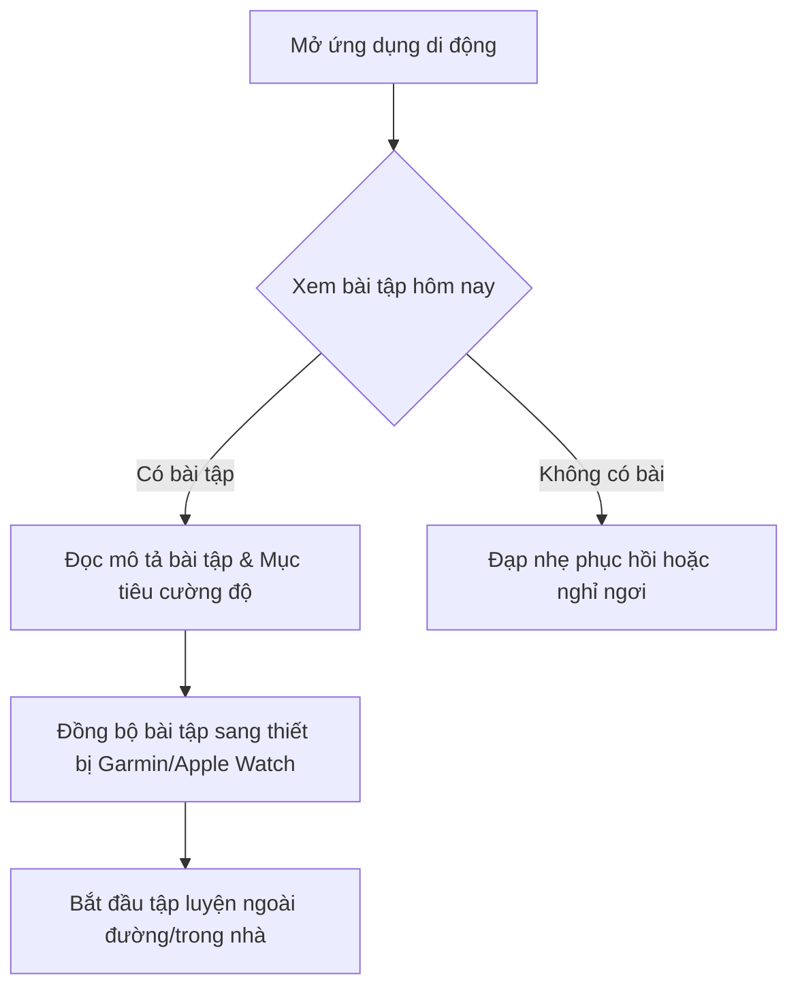
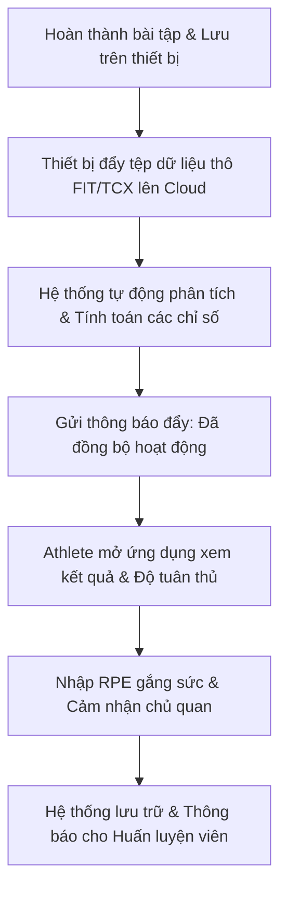

# Chương 10: Nền tảng dành cho Vận động viên (Athlete Platform)

Nếu Huấn luyện viên cần một công cụ quản lý năng suất và lập kế hoạch hàng loạt, thì Vận động viên (Athlete) cần một trải nghiệm cá nhân hóa, dễ dùng, trực quan và mang lại động lực tập luyện mỗi ngày. Giao diện của vận động viên phải cân bằng giữa việc cung cấp thông số kỹ thuật sâu sắc và tính đơn giản trong sử dụng hàng ngày.

---

## 1. Các cấu phần cốt lõi của Trải nghiệm Vận động viên

### 1. Lịch tập luyện (Calendar)
*   **Mục tiêu**: Nơi hiển thị giáo án huấn luyện và tiến trình thực tế. Đây là giao diện trung tâm mà vận động viên mở ra đầu tiên mỗi ngày.
*   **Hành động**: Xem bài tập hôm nay, xem bài tập kế hoạch tuần tới, kéo thả bài tập sang ngày khác (nếu được phép), xem tổng kết tuần (tổng thời gian, cự ly và điểm tải tích lũy).

### 2. Bảng điều khiển cá nhân (Dashboard)
*   **Mục tiêu**: Hiển thị nhanh các thông tin sức khỏe và trạng thái hiện tại.
*   **Hành động**: Theo dõi nhịp tim nghỉ, HRV buổi sáng, cân nặng hiện tại, trạng thái giấc ngủ và đề xuất mức độ sẵn sàng tập luyện hôm nay.

### 3. Phân tích chi tiết buổi tập (Activity Analysis)
*   **Mục tiêu**: Tìm hiểu xem mình đã tập luyện thế nào trong buổi tập vừa hoàn thành.
*   **Hành động**: Xem biểu đồ các dòng dữ liệu (nhịp tim, tốc độ, cao độ), xem thời gian nằm trong các Zone (Time in Zones), xem bảng phân tích các hiệp biến tốc (Laps analysis) và xem các đỉnh nỗ lực tối đa (Peak Performances).

### 4. Theo dõi thể lực dài hạn (Fitness Tracking)
*   **Mục tiêu**: Thấy được sự tiến bộ của bản thân theo thời gian.
*   **Hành động**: Quan sát sự thay đổi của các chỉ số FTP, LTHR, cân nặng và theo dõi sự phát triển của biểu đồ thể lực (CTL/ATL/TSB).

### 5. Thiết lập và Theo dõi mục tiêu (Goal Tracking)
*   **Mục tiêu**: Đặt ra các cột mốc đích và theo dõi sự chuẩn bị.
*   **Hành động**: Đặt mục tiêu chạy 42km dưới 4 giờ tại giải Marathon vào tháng 12, theo dõi tiến độ tổng quãng đường tích lũy hàng tuần so với đích đề ra.

---

## 2. Luồng nghiệp vụ chính của Vận động viên (Athlete Workflows)

### Luồng 1: Chuẩn bị trước buổi tập (Pre-workout Workflow)


### Luồng 2: Phân tích sau buổi tập (Post-workout Workflow)


---

## 3. Ví dụ thực tế

### Ví dụ về Athlete
Vận động viên A sáng sớm thức dậy, mở ứng dụng và thấy chỉ số HRV buổi sáng của mình giảm sút nghiêm trọng ($30\ ms$ so với trung bình $65\ ms$) do mất ngủ đêm qua. Đồng thời bài tập trên lịch hôm nay là một buổi chạy Tempo cường độ cao. A quyết định dời bài tập Tempo sang ngày mai và hôm nay chỉ chạy nhẹ nhàng 30 phút.

### Ví dụ về Coach
Huấn luyện viên của A nhận được thông báo về việc thay đổi lịch tập trên. Coach đồng ý với quyết định sinh lý của A vì HRV thấp phản ánh Hệ giao cảm đang chịu áp lực lớn, nếu tập nặng hôm nay sẽ tăng nguy cơ chấn thương hoặc kiệt sức.

### Ví dụ về Product
Phát triển tính năng **"Đề xuất Sẵn sàng Tập luyện" (Readiness Score Engine)**. Thuật toán tự động tổng hợp: Điểm giấc ngủ đêm qua, Xu hướng HRV 7 ngày qua, Thể lực hiện tại (CTL/ATL), và Độ mỏi cơ để chấm điểm từ 1 đến 100:
*   `85 - 100`: **Sẵn sàng cao (Optimal)**. Đề xuất: *"Cơ thể phục hồi xuất sắc. Bạn có thể tập nặng hôm nay!"*
*   `dưới 50`: **Cần nghỉ ngơi (Rest)**. Đề xuất: *"Nên nghỉ hoặc tập rất nhẹ."*

### Ví dụ về Cơ sở dữ liệu (Database Schema)
Bảng lưu trữ thông số Sức khỏe hàng ngày do Vận động viên ghi nhận hoặc đồng bộ từ Apple Health / Google Fit:

```sql
CREATE TABLE athlete_health_sync (
    id UUID PRIMARY KEY DEFAULT gen_random_uuid(),
    athlete_id UUID NOT NULL REFERENCES athletes(id) ON DELETE CASCADE,
    date DATE NOT NULL,
    sleep_duration_seconds INT,
    sleep_deep_seconds INT,
    sleep_score INT, -- Thường thang điểm 1-100 từ thiết bị (Oura, Garmin)
    hrv_rmssd DOUBLE PRECISION,
    resting_heart_rate INT,
    steps_count INT,
    active_calories INT,
    created_at TIMESTAMP WITH TIME ZONE DEFAULT CURRENT_TIMESTAMP,
    UNIQUE(athlete_id, date)
);

CREATE INDEX idx_athlete_health_date ON athlete_health_sync(athlete_id, date DESC);
```

### Ví dụ về Giao diện người dùng (UI)
*   **Màn hình Lịch tập luyện (Calendar UI)**:
    *   Thiết kế tối giản dạng lưới theo tuần (như Google Calendar nhưng tối ưu hóa cho thẻ bài tập).
    *   Mỗi ngày là một cột. Các thẻ bài tập có bo góc nhẹ, hiển thị biểu tượng môn thể thao (hình người chạy, xe đạp, người bơi), tên bài tập và điểm Tải.
    *   Nền của thẻ bài tập tự động đổi màu theo độ tuân thủ (Xanh lá, Vàng, Đỏ).

### Ví dụ về Dashboard
Một biểu đồ vòng tròn lớn (Gauge Widget) ở chính giữa màn hình chính hiển thị **"Điểm Sẵn sàng" (Readiness Score)** của ngày hôm nay kèm theo lời khuyên ngắn gọn dễ hiểu, thay thế cho việc hiển thị hàng tá biểu đồ phức tạp đối với người dùng không chuyên.

---

## 4. Sai lầm phổ biến khi thiết kế sản phẩm (Common Pitfalls)

1.  **Giao diện quá phức tạp, ngập tràn chỉ số (Information Overload)**:
    *   *Sai lầm*: Bắt chước hoàn toàn giao diện của WKO (phần mềm phân tích chuyên sâu cho các nhà khoa học thể thao) và đưa toàn bộ các chỉ số như W' Balance, EF, VI lên trang chủ của ứng dụng di động dành cho vận động viên phong trào. Người dùng sẽ cảm thấy bối rối và rời bỏ ứng dụng.
    *   *Giải pháp*: Áp dụng triết lý thiết kế **Tiết lộ tăng tiến (Progressive Disclosure)**. Màn hình chính chỉ hiển thị các chỉ số dễ hiểu: Quãng đường tuần, Trạng thái phong độ, Điểm phục hồi. Nếu người dùng muốn xem phân tích sâu, họ có thể nhấn vào nút `[Phân tích nâng cao]` để mở các biểu đồ công suất và nhịp tim chi tiết.
2.  **Đồng bộ hóa chậm (Slow Synchronization / Lag)**:
    *   *Sai lầm*: Sau khi chạy xong, vận động viên mở ứng dụng và phải đợi 5-10 phút để bài tập đồng bộ từ Garmin Connect về ứng dụng của bạn do backend xử lý tuần tự tệp FIT rất chậm.
    *   *Giải pháp*: Thiết kế pipeline xử lý bất đồng bộ sử dụng hàng đợi tin nhắn (Message Queue - như RabbitMQ hoặc AWS SQS). Khi nhận webhook từ Garmin API:
        1.  Backend lưu tệp FIT thô vào Cloud Storage lập tức.
        2.  Phản hồi trạng thái `200 OK` cho Garmin trong vòng 200ms để tránh timeout.
        3.  Đẩy một job vào Message Queue.
        4.  Worker chạy luồng phân tích tệp FIT ở background, cập nhật cơ sở dữ liệu.
        5.  Đẩy thông báo thời gian thực cho Client qua WebSockets để cập nhật UI ngay lập tức.
3.  **Khóa cứng không cho phép vận động viên tự điều chỉnh lịch tập**:
    *   *Sai lầm*: Coi lịch tập của huấn luyện viên giao là tuyệt đối và không cho phép vận động viên kéo thả đổi ngày bài tập khi họ có lịch bận đột xuất.
    *   *Giải pháp*: Cung cấp cài đặt cấu hình quyền kiểm soát lịch (Calendar Permissions). Cho phép Huấn luyện viên quyết định: *"Cho phép VĐV tự dời lịch bài tập trong phạm vi $\pm 3$ ngày"* hoặc *"Lịch khóa cứng, mọi thay đổi phải do Coach duyệt"*.
