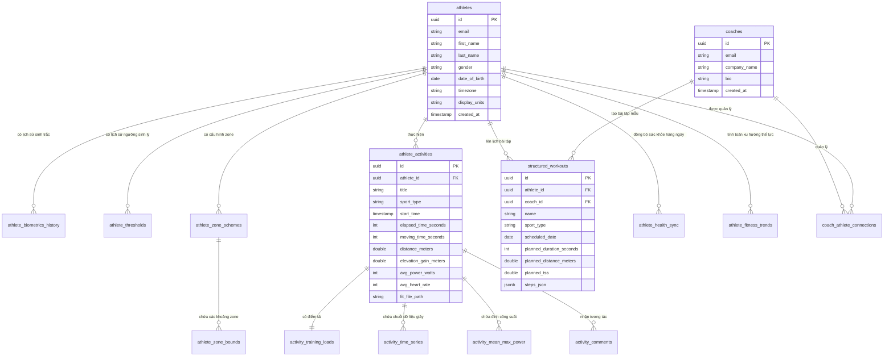

# Chương 11: Kiến thức Kiến trúc Dữ liệu & Thiết kế Cơ sở dữ liệu (Data Architecture)

Kiến trúc dữ liệu của một nền tảng thể thao sức bền phải giải quyết được hai thách thức lớn song song:
1.  **Dữ liệu cấu trúc quan hệ (Relational Data)**: Quản lý mối quan hệ phức tạp giữa Huấn luyện viên - Vận động viên, lịch tập luyện, cấu trúc bài tập kế hoạch và các ngưỡng sinh lý thay đổi theo thời gian.
2.  **Dữ liệu chuỗi thời gian khổng lồ (Time-series / IoT Data)**: Lưu trữ và xử lý hàng tỷ điểm dữ liệu cảm biến đo đạc mỗi giây (nhịp tim, công suất, tọa độ GPS) gửi về từ các thiết bị thông minh.

Chương này mô tả thiết kế cơ sở dữ liệu quan hệ hoàn chỉnh và cách tích hợp với cơ sở dữ liệu time-series phục vụ cho việc xây dựng nền tảng.

---

## 1. Biểu đồ Quan hệ Thực thể (ERD) bằng Mermaid

Dưới đây là thiết kế cơ sở dữ liệu lõi cho hệ thống:



---

## 2. Đặc tả các Bảng dữ liệu chính

### 1. Bảng Vận động viên (athletes) và Huấn luyện viên (coaches)
*   **Tại sao tồn tại**: Lưu trữ thông tin định danh và cài đặt hiển thị (ví dụ: Metric vs Imperial).
*   **Ví dụ Database**: Xem ERD ở trên. Lưu ý lưu múi giờ (`timezone`) để tính toán chính xác "ngày hôm nay" của vận động viên khi đồng bộ bài tập (tránh lệch múi giờ làm bài tập bị nhảy sang ngày hôm sau trên lịch).

### 2. Bảng Lịch sử Ngưỡng sinh lý (athlete_thresholds)
*   **Tại sao tồn tại**: Theo dõi sự thay đổi của FTP, LTHR, Max HR theo thời gian để làm tham chiếu tính toán lịch sử.
*   **Quy tắc truy vấn**: Để tính tải tập luyện của một bài tập vào ngày $D$, hệ thống phải tìm ngưỡng có hiệu lực tại ngày $D$:
    ```sql
    SELECT ftp, threshold_hr, threshold_pace 
    FROM athlete_thresholds 
    WHERE athlete_id = :athlete_id 
      AND sport_type = :sport_type
      AND effective_date <= :activity_date
    ORDER BY effective_date DESC 
    LIMIT 1;
    ```

### 3. Bảng Hoạt động thực tế (athlete_activities)
*   **Tại sao tồn tại**: Lưu trữ các chỉ số tổng hợp của buổi tập sau khi phân tích tệp FIT.
*   **Ví dụ Database**: Xem schema chi tiết ở Chương 4.

### 4. Bảng Dữ liệu Chuỗi thời gian (activity_time_series)
*   **Tại sao tồn tại**: Lưu trữ hàng chục nghìn điểm dữ liệu ghi nhận mỗi giây trong buổi tập để vẽ biểu đồ và phân tích chi tiết.
*   **Giải pháp lưu trữ cho Software Architect**: 
    *   *Phương án 1*: Lưu vào cơ sở dữ liệu quan hệ (PostgreSQL). **Nhược điểm**: Mỗi bài tập chạy 5 tiếng tạo ra $18,000$ hàng. Nếu có $10,000$ vận động viên tập luyện hàng ngày, bảng này sẽ phình to hàng tỷ hàng trong vài tháng, gây chậm truy vấn trầm trọng.
    *   *Phương án 2 (Khuyên dùng)*: Sử dụng cơ sở dữ liệu chuyên dụng cho chuỗi thời gian (TimescaleDB, InfluxDB) hoặc nén chuỗi dữ liệu thành định dạng nhị phân/JSON nén (như Protocol Buffers) và lưu trữ dưới dạng một tệp `.json.gz` hoặc `.bin` trên Cloud Storage (AWS S3, Google Cloud Storage). Khi người dùng mở xem chi tiết, Frontend tải trực tiếp tệp nén này từ Cloud Storage về trình duyệt để phân tích và vẽ biểu đồ bên phía Client (Client-side rendering). Giải pháp này giảm tải $90\%$ chi phí Database và CPU của Backend.

### 5. Thuật toán nén tọa độ địa lý GPS (Douglas-Peucker)
*   **Vấn đề**: Dữ liệu GPS ghi nhận mỗi giây trong 5 tiếng chạy bộ tạo ra khoảng $18,000$ điểm tọa độ kinh độ/vĩ độ (Lat/Lon). Truyền tải mảng tọa độ này qua API và bắt Client vẽ đường đi lên bản đồ (Google Maps/Mapbox) sẽ gây ngốn băng thông mạng và giật lag trình duyệt.
*   **Giải pháp**: Áp dụng thuật toán **Douglas-Peucker (Ramer-Douglas-Peucker - RDP)** ở Backend trước khi đóng gói tệp JSON. 
    *   *Nguyên lý*: Thuật toán duyệt qua chuỗi điểm, vẽ một đường thẳng nối điểm đầu và điểm cuối, sau đó tìm điểm có khoảng cách vuông góc lớn nhất ($d_{max}$) tới đường thẳng đó. 
    *   Nếu $d_{max}$ lớn hơn một ngưỡng sai số cho phép ($\epsilon$ - epsilon, ví dụ $0.00005$ tương đương khoảng $5$ mét trên thực tế), điểm đó được giữ lại làm mốc gãy khúc, và thuật toán đệ quy tiếp tục chạy trên 2 đoạn thẳng mới chia nhỏ.
    *   Nếu $d_{max} < \epsilon$, toàn bộ các điểm trung gian nằm giữa được lược bỏ vì chúng nằm gần như trên một đường thẳng.
    *   *Kết quả*: Nén giảm $80\% - 95\%$ số lượng điểm GPS (từ $18,000$ điểm xuống còn dưới $1,000$ điểm) nhưng vẫn giữ nguyên hình dáng cung đường thực tế trên bản đồ, giúp hiển thị mượt mà.

---

## 3. Ví dụ thực tế

### Ví dụ về Athlete
Vận động viên A nhấn nút đồng bộ trên điện thoại. Hệ thống kiểm tra múi giờ của A là `Asia/Ho_Chi_Minh` để xác định bài tập chạy bộ diễn ra lúc 5 giờ sáng ngày 9 tháng 6 năm 2026 sẽ được điền vào ô lịch của đúng ngày 9 tháng 6 trên giao diện web.

### Ví dụ về Coach
Huấn luyện viên B kéo một bài tập từ thư viện vào ngày 12 tháng 6 năm 2026 của A. Hệ thống chèn một hàng mới vào bảng `structured_workouts` với trường `scheduled_date = '2026-06-12'` và lưu cấu trúc các hiệp chạy biến tốc vào trường `steps_json`.

### Ví dụ về Product
Thiết kế tính năng **"Cảnh báo Lệch Ngưỡng"**. Khi tính toán bài tập chạy bộ mới, nếu hệ thống phát hiện Nhịp tim trung bình trong 20 phút chạy biến tốc cao hơn LTHR cũ lưu trong `athlete_thresholds` 5 nhịp, hệ thống sẽ tự động ghi một bản ghi đề xuất vào bảng `pending_threshold_updates` để hiển thị trên UI của vận động viên.

### Ví dụ về Database (Lưu trữ tệp thô và Siêu dữ liệu)
```sql
CREATE TABLE raw_activity_files (
    id UUID PRIMARY KEY DEFAULT gen_random_uuid(),
    athlete_id UUID NOT NULL REFERENCES athletes(id) ON DELETE CASCADE,
    activity_id UUID REFERENCES athlete_activities(id) ON DELETE SET NULL,
    file_name VARCHAR(255) NOT NULL,
    file_size_bytes INT NOT NULL,
    storage_provider VARCHAR(50) NOT NULL, -- 's3', 'gcs', 'local'
    storage_key VARCHAR(512) NOT NULL, -- Đường dẫn đến file trên S3 (ví dụ: 'activities/2026/06/09/file.fit')
    file_format VARCHAR(10) NOT NULL, -- 'fit', 'tcx', 'gpx'
    uploaded_at TIMESTAMP WITH TIME ZONE DEFAULT CURRENT_TIMESTAMP
);
```

### Ví dụ về Giao diện người dùng (UI)
Khi người dùng mở một trang phân tích hoạt động, Backend sẽ trả về dữ liệu của bảng `athlete_activities` cùng với đường dẫn `storage_key` của tệp chuỗi thời gian. Thư viện vẽ biểu đồ trên web (ví dụ: Chart.js hoặc Highcharts) sẽ gọi API tải tệp chuỗi thời gian nén đó về để vẽ đồ thị trong vòng dưới 200ms.

---

## 4. Sai lầm phổ biến khi thiết kế sản phẩm (Common Pitfalls)

1.  **Lưu dữ liệu chuỗi thời gian (giây) vào bảng SQL truyền thống không phân vùng**:
    *   *Sai lầm*: Chèn mỗi giây dữ liệu thành 1 dòng trong bảng SQL lớn. Sau khi ứng dụng chạy được 1 năm, bảng này đạt quy mô hàng trăm triệu bản ghi. Việc chạy lệnh `SELECT * FROM activity_time_series WHERE activity_id = :id` để vẽ biểu đồ sẽ mất vài giây hoặc làm sập bộ nhớ của DB.
    *   *Giải pháp*: Nếu dùng Postgres, hãy cài đặt tiện ích **TimescaleDB** để tự động phân vùng bảng (Hypertable) theo `activity_id` và thời gian, hoặc lưu trữ chuỗi dữ liệu dưới dạng tệp nén tĩnh trên Cloud Storage như đã mô tả ở trên.
2.  **Xóa thông tin ngưỡng sinh lý cũ khi cập nhật ngưỡng mới**:
    *   *Sai lầm*: Khi vận động viên cập nhật FTP mới từ 200W lên 220W, hệ thống ghi đè giá trị cũ trong bảng `athletes`. Lỗi này làm mất đi khả năng tính toán chính xác tải tập luyện cho các bài tập trong quá khứ.
    *   *Giải pháp*: Luôn sử dụng cơ chế chèn thêm (Insert-Only) cho các bảng ngưỡng sinh lý và sinh trắc học. Mỗi lần cập nhật là một dòng mới kèm theo ngày bắt đầu có hiệu lực (`effective_date`).
3.  **Không xử lý đồng nhất múi giờ (Timezone Mismanagement)**:
    *   *Sai lầm*: Lưu thời gian bắt đầu bài tập (`start_time`) dưới dạng chuỗi văn bản không có múi giờ (ví dụ: `2026-06-09 05:00:00`). Khi vận động viên bay từ Việt Nam sang Mỹ tập luyện, bài tập đồng bộ về sẽ bị lệch 12 tiếng và nhảy sang ngày hôm sau trên Lịch tập luyện, gây rối loạn lịch trình của huấn luyện viên.
    *   *Giải pháp*: Luôn sử dụng kiểu dữ liệu `TIMESTAMP WITH TIME ZONE` (hoặc lưu thời gian UTC kèm theo một cột lưu múi giờ gốc của thiết bị ghi nhận, ví dụ: `Asia/Ho_Chi_Minh`). Khi render lịch tập, hãy chuyển đổi thời gian UTC sang múi giờ hiển thị được cấu hình trong hồ sơ của vận động viên.
