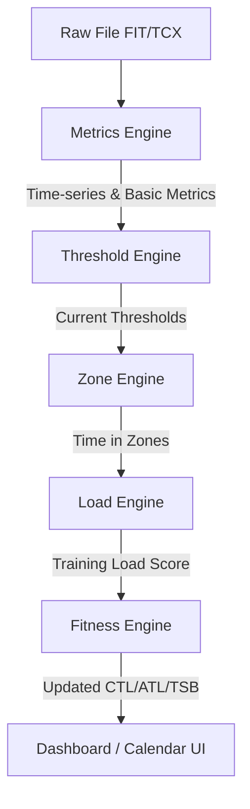

# Chương 12: Động cơ Phân tích (Analytics Engine)

Động cơ Phân tích (Analytics Engine) là bộ não xử lý trung tâm của toàn bộ nền tảng thể thao sức bền. Khi một tệp dữ liệu thô (FIT/TCX) được tải lên, nó phải đi qua một chuỗi xử lý dữ liệu (Data Pipeline) gồm nhiều động cơ chuyên biệt xếp chồng lên nhau. Sự thay đổi kết quả của động cơ phía trước sẽ quyết định đầu vào của động cơ phía sau.

---

## 1. Kiến trúc phân tầng và Chuỗi phụ thuộc dữ liệu (Data Dependency Pipeline)

Để hệ thống hoạt động chính xác và có khả năng mở rộng tốt, các động cơ tính toán được thiết kế thành một luồng xử lý tuần tự (pipeline):



### 1. Động cơ Chỉ số cơ bản (Metrics Engine)
*   **Nhiệm vụ**: Phân tích cú pháp tệp nhị phân thô (Parser), trích xuất chuỗi dữ liệu từng giây, thực hiện làm sạch dữ liệu (lọc các đỉnh nhiễu công suất hoặc GPS bị lỗi), và tính toán các chỉ số cơ bản ($P_{avg}$, $HR_{avg}$, Moving Time, Distance, Max Speed).
*   **Đầu vào**: Tệp tin FIT/TCX/GPX.
*   **Đầu ra**: Chuỗi dữ liệu time-series đã được làm mịn và bản ghi tóm tắt hoạt động thô.

### 2. Động cơ Ngưỡng sinh lý (Threshold Engine)
*   **Nhiệm vụ**: Truy vấn cơ sở dữ liệu để tìm ra các ngưỡng sinh lý (FTP, LTHR, Threshold Pace) đang có hiệu lực của vận động viên tại ngày diễn ra hoạt động. Đồng thời, chạy thuật toán phát hiện xem buổi tập này có kích hoạt một ngưỡng mới cao hơn ngưỡng cũ hay không.
*   **Đầu vào**: `athlete_id`, `sport_type`, ngày diễn ra bài tập.
*   **Đầu ra**: Các giá trị ngưỡng sinh lý tương ứng của vận động viên tại thời điểm đó.

### 3. Động cơ Phân vùng (Zone Engine)
*   **Nhiệm vụ**: Lấy các ngưỡng sinh lý từ Threshold Engine, nhân với tỷ lệ cấu hình vùng của vận động viên để xây dựng các khoảng Zone tuyệt đối. Sau đó, duyệt qua chuỗi dữ liệu từng giây từ Metrics Engine để tính tổng thời gian vận động viên nằm trong từng Zone (ví dụ: 45 phút ở Zone 2, 12 phút ở Zone 4).
*   **Đầu vào**: Chuỗi dữ liệu giây và các ngưỡng sinh lý hiện hành.
*   **Đầu ra**: Bảng phân bổ thời gian nằm trong các phân vùng (Time in Zones Distribution).

### 4. Động cơ Tải tập luyện (Load Engine)
*   **Nhiệm vụ**: Tính toán điểm số tải tập luyện cuối cùng của buổi tập (TSS, hrTSS, rTSS hoặc TRIMP) dựa trên các chỉ số đã được chuẩn hóa bởi Metrics Engine (như NP, NGP) và các ngưỡng sinh lý từ Threshold Engine.
*   **Đầu vào**: Kết quả của Metrics Engine và Threshold Engine.
*   **Đầu ra**: Điểm số Tải tập luyện (ví dụ: 85 TSS) và phương pháp tính toán tương ứng.

### 5. Động cơ Thể lực (Fitness Engine)
*   **Nhiệm vụ**: Lấy điểm số Tải tập luyện của buổi tập vừa hoàn thành chèn vào chuỗi lịch sử của vận động viên, sau đó chạy công thức EMA để cập nhật lại các chỉ số CTL, ATL, TSB từ ngày diễn ra bài tập đó cho đến ngày hiện tại và tương lai.
*   **Đầu vào**: Điểm số Tải tập luyện của bài tập mới (hoặc các bài tập bị thay đổi/xóa) và trạng thái CTL/ATL của ngày trước đó.
*   **Đầu ra**: Xu hướng thể lực mới được cập nhật trên biểu đồ của vận động viên.

---

## 2. Ví dụ thực tế trong Phát triển Hệ thống

### Ví dụ về Athlete
Vận động viên tải lên một buổi chạy bộ dài 1.5 giờ.

### Ví dụ về Coach
Huấn luyện viên xem lại đồ thị thể lực của Athlete ngay sau khi buổi chạy được đồng bộ. Biểu đồ CTL tăng nhẹ từ 65.2 lên 65.8, phản ánh thể lực tích lũy của Athlete đang phát triển đúng hướng.

### Ví dụ về Product (Kiến trúc xử lý bất đồng bộ - Event-Driven Architecture)
Để hệ thống không bị nghẽn và phản hồi UI nhanh chóng, chúng ta thiết kế các Engine chạy dưới dạng các **Workers chuyên biệt (Microservices hoặc Serverless Functions)** giao tiếp với nhau qua hàng đợi tin nhắn (Message Queue).

```text
1. [API Gateway] nhận file FIT -> Lưu vào S3 -> Đẩy event 'activity.uploaded' vào Queue.
2. [Metrics Worker] nhận event -> Parse file FIT -> Tính toán NP, NGP -> Lưu vào DB -> Đẩy event 'metrics.calculated'.
3. [Threshold Worker] nhận event -> Xác định FTP/LTHR hiệu lực -> Đẩy event 'thresholds.resolved'.
4. [Zone & Load Worker] nhận event -> Tính Time-in-Zones và TSS -> Lưu vào DB -> Đẩy event 'load.calculated'.
5. [Fitness Worker] nhận event -> Chạy EMA cập nhật CTL/ATL/TSB -> Cập nhật DB -> Gửi tín hiệu WebSocket 'fitness.updated' báo cho Frontend cập nhật UI.
```

### Ví dụ về Database (Quản lý trạng thái xử lý - Job Status)
Bảng theo dõi trạng thái chạy của Pipeline để xử lý lỗi và tính toán lại khi cần:

```sql
CREATE TABLE activity_processing_jobs (
    id UUID PRIMARY KEY DEFAULT gen_random_uuid(),
    activity_id UUID NOT NULL,
    status VARCHAR(50) NOT NULL, -- 'queued', 'processing_metrics', 'processing_load', 'completed', 'failed'
    current_step VARCHAR(50),
    error_message TEXT,
    retry_count INT DEFAULT 0,
    started_at TIMESTAMP WITH TIME ZONE,
    updated_at TIMESTAMP WITH TIME ZONE DEFAULT CURRENT_TIMESTAMP
);
```

### Ví dụ về Giao diện người dùng (UI)
Khi vận động viên vừa tải tệp lên, màn hình hiển thị một hiệu ứng tải nhẹ (shimmer effect hoặc spinner) kèm theo các trạng thái cập nhật động:
*   `[✓] Đang đọc dữ liệu tệp tin`
*   `[✓] Đang tính toán các phân vùng tập luyện`
*   `[✓] Đang cập nhật biểu đồ thể lực của bạn`
Quá trình này diễn ra trong vòng dưới 2 giây mang lại cảm giác hệ thống cực kỳ mượt mà và chuyên nghiệp.

---

## 3. Sai lầm phổ biến khi thiết kế sản phẩm (Common Pitfalls)

1.  **Lập trình các Engine thành một khối mã nguồn duy nhất (Monolithic Engine)**:
    *   *Sai lầm*: Viết một hàm khổng lồ dài 2000 dòng code xử lý từ A-Z từ đọc file FIT đến cập nhật CTL/ATL. Lỗi này làm cho việc bảo trì, tối ưu hóa hiệu năng hoặc viết unit test cho từng phần sinh lý học trở nên bất khả thi. Nếu lỗi xảy ra ở bước tính Fitness, toàn bộ thông tin buổi tập cơ bản cũng bị mất sạch.
    *   *Giải pháp*: Phân tách mã nguồn thành các module độc lập theo đúng nguyên lý **Trách nhiệm đơn lẻ (Single Responsibility Principle)**. Mỗi Engine là một class hoặc một service riêng biệt có interface định nghĩa rõ ràng về Input và Output.
2.  **Lỗi chạy đua dữ liệu (Race Conditions) khi cập nhật Fitness**:
    *   *Sai lầm*: Vận động viên đồng bộ cùng lúc 3 bài tập từ các thiết bị khác nhau (ví dụ: 1 bài chạy buổi sáng trên đồng hồ Garmin, 1 bài tập tạ buổi trưa ghi nhận bằng Apple Watch, và 1 bài đạp xe buổi tối trên Wahoo). Nếu 3 tiến trình worker chạy Fitness Engine song song và cùng đọc CTL của ngày hôm trước để tính toán ngày hôm nay, chúng sẽ ghi đè đè lên nhau (Race Condition) dẫn đến kết quả CTL/ATL cuối cùng bị sai lệch.
    *   *Giải pháp*: Sử dụng cơ chế khóa phân tán (Distributed Locking - ví dụ dùng Redis Lock hoặc Postgres Row Lock `SELECT FOR UPDATE` trên bảng `athlete_fitness_trends` theo `athlete_id`) để đảm bảo tại một thời điểm chỉ có duy nhất một luồng tính toán Fitness được chạy cho một vận động viên cụ thể, xếp hàng các yêu cầu tính toán còn lại.
3.  **Không tối ưu hóa việc tính toán lại diện rộng (Mass Recalculation)**:
    *   *Sai lầm*: Khi vận động viên phát hiện FTP của họ bị thiết lập sai trong suốt 3 tháng qua và bấm nút sửa lại FTP lịch sử. Hệ thống thực hiện cập nhật và kích hoạt tính toán lại tuần tự từng bài tập một trong 3 tháng đó qua các truy vấn HTTP chậm chạp.
    *   *Giải pháp*: Thiết kế cơ chế xử lý hàng loạt (Batch Processing). Gom tất cả các hoạt động cần tính toán lại, thực hiện tính toán song song các chỉ số phụ thuộc độc lập (Metrics, Zones, Load) trước, sau đó chạy một vòng lặp tuyến tính duy nhất trên bộ nhớ (in-memory loop) để tính chuỗi CTL/ATL/TSB lũy thừa một lần duy nhất trước khi ghi hàng loạt (bulk insert/update) vào database.
