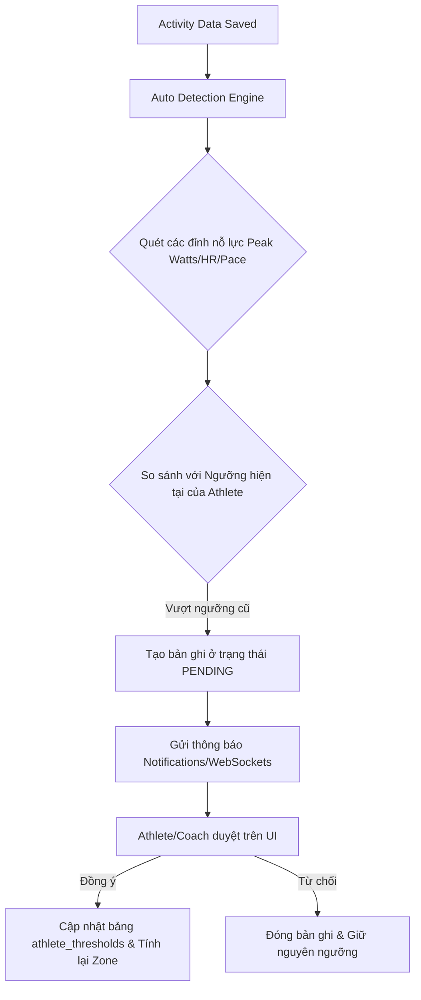

# Chương 13: Động cơ Tự động phát hiện Ngưỡng (Auto Detection Engine)

Một trong những rào cản lớn nhất đối với người tập thể thao sức bền là sự thiếu kiến thức chuyên môn để tự thiết lập các ngưỡng sinh lý như FTP, LTHR hay Critical Pace. Nếu để các thông số này không chính xác trong thời gian dài, toàn bộ giáo án tập luyện sẽ bị sai lệch cường độ (hoặc quá nhẹ hoặc quá nặng gây chấn thương). Động cơ Tự động phát hiện (Auto Detection Engine) đóng vai trò tự động giám sát dữ liệu và đề xuất điều chỉnh các ngưỡng này khi vận động viên đạt được các cột mốc hiệu suất mới.

---

## 1. Thuật toán lọc nhiễu cảm biến (Outlier/Sensor Spike Detection Filter)
*   *Vấn đề*: Các cảm biến thể thao (đặc biệt là cảm biến công suất đạp xe giá rẻ hoặc đai tim bị khô điện cực) thường xuyên bị lỗi truyền nhận dữ liệu tạo ra các đỉnh nhọn bất thường (sensor spikes) - ví dụ công suất nhảy vọt lên 2000W trong 1 giây, hoặc nhịp tim tăng vọt từ 130 lên 220 BPM rồi hạ xuống lập tức. Nếu Động cơ Tự động phát hiện ngưỡng sử dụng dòng dữ liệu thô này, nó sẽ tạo ra hàng loạt cảnh báo cập nhật ngưỡng ảo (false positives).
*   *Giải pháp*: Trước khi chạy bất kỳ thuật toán phát hiện ngưỡng nào, dữ liệu time-series phải đi qua bộ lọc nhiễu:
    1.  **Lọc giới hạn vật lý tuyệt đối (Hard Cutoff)**:
        *   Loại bỏ toàn bộ các điểm dữ liệu công suất Đạp xe $> 2200W$ (ngưỡng lực tối đa của các tay đua nước rút chuyên nghiệp thế giới).
        *   Loại bỏ dữ liệu nhịp tim chạy bộ $> 220$ BPM (hoặc dựa trên công thức $220 - Tuổi + 15$ BPM làm trần).
    2.  **Lọc tốc độ biến thiên (Delta / Gradient Filter)**:
        *   Nhịp tim con người không thể thay đổi quá 10 BPM chỉ trong 1 giây. Nếu có sự thay đổi đột ngột $|HR_t - HR_{t-1}| > 10$ BPM, hệ thống đánh dấu điểm $HR_t$ là nhiễu và nội suy tuyến tính lại dựa trên $HR_{t-1}$ và $HR_{t+1}$.
        *   Công suất đạp xe không thể duy trì ở mức tăng đột biến gấp 5 lần công suất trung bình 30 giây trước đó nếu chỉ diễn ra trong vòng 1-2 giây. Áp dụng thuật toán lọc trung bình trượt để làm mịn (smooth) các đỉnh nhọn ngắn hạn dưới 3 giây.

---

## 2. Các thuật toán tự động phát hiện ngưỡng (Detection Algorithms)

### 1. Tự động phát hiện FTP / eFTP (Đạp xe)
Hệ thống sử dụng hai phương pháp chính chạy ngầm sau mỗi buổi tập:
*   **Quy tắc Đỉnh 20 phút (20-min Peak Rule)**: 
    *   *Thuật toán*: Tìm kiếm trong chuỗi dữ liệu công suất của buổi tập khoảng thời gian 20 phút liên tục có công suất trung bình cao nhất ($MMP_{20min}$).
    *   *Điều kiện*: Nếu $MMP_{20min} \times 0.95 > FTP_{current}$, hệ thống ghi nhận một đề xuất tăng FTP mới.
*   **Mô hình eFTP dựa trên Đường cong Công suất (Power Duration Curve - PDC)**:
    *   *Thuật toán*: Intervals.icu sử dụng mô hình này. Hệ thống tìm nỗ lực tối đa tốt nhất của buổi tập trong khoảng thời gian từ 3 phút đến 12 phút (thời gian tối ưu để tim mạch đạt trạng thái giới hạn tối đa mà không bị giới hạn bởi yếu tố kị khí thuần túy). 
    *   *Ví dụ*: Vận động viên đạp đạt đỉnh 5 phút ở mức 300W. Dựa trên mô hình toán học dự đoán suy giảm công suất của Morton, hệ thống ngoại suy ra công suất tối đa ở mốc 1 giờ (FTP ước tính - eFTP) tương đương là 245W. Nếu 245W lớn hơn FTP hiện tại, hệ thống đề xuất FTP mới.

### 2. Tự động phát hiện Nhịp tim ngưỡng (Threshold Heart Rate - LTHR)
*   **Thuật toán (Joe Friel Rule)**:
    1.  Tìm kiếm các khoảng thời gian vận động cường độ cao liên tục kéo dài ít nhất 20 phút hoặc 30 phút trong buổi tập.
    2.  Tính nhịp tim trung bình của 20 phút cuối cùng trong khoảng thời gian đó ($HR_{avg\_last\_20min}$).
    3.  *Điều kiện*: Vận động viên phải có trạng thái gắng sức cao (ví dụ: công suất ở mức Zone 4 hoặc tốc độ đạt sát Threshold Pace). Nếu $HR_{avg\_last\_20min} > LTHR_{current}$, hệ thống đề xuất tăng LTHR.

### 3. Tự động phát hiện Công suất tới hạn (Critical Power - CP) và $W'$
*   **Thuật toán**: Hệ thống tự động quét lịch sử tập luyện trong 90 ngày qua. Tìm ra các đỉnh công suất tối đa (Mean Max Power) ở ít nhất 3 khoảng thời gian khác nhau (ví dụ: 1 phút, 5 phút, và 15 phút). Sau đó áp dụng phương pháp hồi quy tuyến tính bình phương tối thiểu (linear regression) để giải phương trình:
    $$Power(t) = CP + \frac{W'}{t}$$
    Từ đó xác định giá trị CP và $W'$ tối ưu nhất khớp với tất cả các đỉnh hiệu suất thực tế của vận động viên.

---

## 2. Thiết kế Kiến trúc Hệ thống Auto Detection Engine

Động cơ tự động phát hiện ngưỡng chạy ở tầng cuối cùng của Pipeline xử lý dữ liệu sau khi Load Engine đã tính toán xong.



---

## 3. Ví dụ thực tế

### Ví dụ về Athlete
Vận động viên A thực hiện buổi đua xe đạp 20km hết sức mình trên Zwift. Trong buổi tập này, A đạp đạt đỉnh 20 phút là 220W. FTP cấu hình hiện tại của A là 200W.

### Ví dụ về Coach
Huấn luyện viên của A nhận được thông báo đề xuất từ hệ thống:
> **"Hệ thống phát hiện FTP mới của Nguyễn Văn A là 209W ($220W \times 0.95$) dựa trên hoạt động hôm nay. Bạn có muốn áp dụng thay đổi này và cập nhật các vùng công suất tập luyện của A không?"**
Coach bấm `[Áp dụng]`.

### Ví dụ về Product
Thiết kế trang **"Nhật ký Ngưỡng" (Threshold Notification Hub)** trên UI. Nơi tập trung toàn bộ lịch sử các đề xuất tăng/giảm ngưỡng do AI tự động phát hiện, kèm theo đường link dẫn đến bài tập thực tế đã kích hoạt đề xuất đó để huấn luyện viên kiểm chứng dữ liệu trước khi phê duyệt.

### Ví dụ về Cơ sở dữ liệu (Database Schema)
Bảng lưu trữ các đề xuất cập nhật ngưỡng sinh lý tự động:

```sql
CREATE TABLE pending_threshold_detections (
    id UUID PRIMARY KEY DEFAULT gen_random_uuid(),
    athlete_id UUID NOT NULL REFERENCES athletes(id) ON DELETE CASCADE,
    sport_type VARCHAR(50) NOT NULL,
    metric_type VARCHAR(50) NOT NULL, -- 'power', 'heart_rate', 'pace'
    current_value DOUBLE PRECISION NOT NULL, -- Ngưỡng cũ (ví dụ: 200)
    detected_value DOUBLE PRECISION NOT NULL, -- Ngưỡng mới phát hiện (ví dụ: 209)
    trigger_activity_id UUID NOT NULL REFERENCES athlete_activities(id) ON DELETE CASCADE,
    status VARCHAR(50) NOT NULL DEFAULT 'pending', -- 'pending', 'approved', 'rejected'
    detected_at TIMESTAMP WITH TIME ZONE DEFAULT CURRENT_TIMESTAMP,
    resolved_at TIMESTAMP WITH TIME ZONE,
    resolved_by UUID -- ID của coach hoặc athlete đã thao tác duyệt
);

CREATE INDEX idx_pending_thresholds_athlete ON pending_threshold_detections(athlete_id) WHERE status = 'pending';
```

### Ví dụ về Giao diện người dùng (UI)
*   Khi người dùng đăng nhập vào ứng dụng, một banner thông báo màu xanh dương nổi bật hiển thị ở đầu trang chủ:
    *   `⚡ Phát hiện FTP mới: 209W (Tăng +9W so với 200W cũ).`
    *   Kèm 2 nút bấm: `[Xem bài tập kích hoạt]` và `[Cập nhật ngay]`.

### Ví dụ về Dashboard
Một widget biểu đồ thể hiện **Đường cong công suất đỉnh 90 ngày (90-day MMP Curve)**:
*   Đường đồ thị biểu thị công suất tối đa của vận động viên.
*   Một đường đứt nét nằm ngang biểu thị mức FTP hiện tại.
*   Khi có một đoạn của đồ thị (ví dụ ở mốc 10 phút) vọt lên quá cao so với đường đứt nét, hệ thống sẽ khoanh tròn vùng đó và hiển thị tooltip: *"Nỗ lực này cho thấy bạn đã khỏe hơn, FTP dự kiến của bạn có thể đạt mức cao hơn."*

---

## 4. Sai lầm phổ biến khi thiết kế sản phẩm (Common Pitfalls)

1.  **Chấp nhận cập nhật tự động không thông qua phê duyệt (Silent Auto-Updates)**:
    *   *Sai lầm*: Hệ thống tự động thay đổi FTP của vận động viên ngay lập tức mà không cần hỏi ý kiến. Nếu tệp FIT bị lỗi cảm biến ghi nhận công suất nhảy vọt lên 1000W trong 20 phút do nhiễu sóng điện từ, FTP của vận động viên sẽ bị đẩy lên mức phi lý. Toàn bộ các bài tập tiếp theo sẽ bị lỗi vì mục tiêu cường độ quá cao.
    *   *Giải pháp*: Luôn lưu đề xuất ở trạng thái **Chờ duyệt (Pending)** trong bảng `pending_threshold_detections`. Chỉ thực hiện ghi vào bảng `athlete_thresholds` khi có hành động bấm nút duyệt trực tiếp từ Vận động viên hoặc Huấn luyện viên.
2.  **Thiếu bộ lọc thời gian tối thiểu để phát hiện LTHR (Lactate Threshold HR)**:
    *   *Sai lầm*: Vận động viên bứt tốc leo dốc ngắn trong 5 phút khiến nhịp tim đạt mức tối đa 190 BPM. Hệ thống lập tức đề xuất LTHR mới là 185 BPM. Điều này sai sinh lý vì LTHR phải là nhịp tim có thể duy trì trong trạng thái ổn định lâu dài (steady-state), không phải nhịp tim tức thời của một nỗ lực cực ngắn.
    *   *Giải pháp*: Chỉ chạy thuật toán phát hiện LTHR trên các khoảng thời gian vận động liên tục ổn định kéo dài **tối thiểu 20 phút** và loại bỏ các bài tập có thời gian vận động quá ngắn.
3.  **Lỗi không cập nhật lại các bài tập trong tương lai sau khi thay đổi ngưỡng**:
    *   *Sai lầm*: Khi vận động viên được duyệt FTP mới từ 200W lên 210W, hệ thống cập nhật ngưỡng sinh lý nhưng không tính toán lại Planned TSS của các bài tập cấu trúc đã lên lịch sẵn cho các tuần tới, làm sai lệch biểu đồ dự báo CTL/ATL tương lai.
    *   *Giải pháp*: Viết logic xử lý sự kiện (Event Handler) sau khi phê duyệt ngưỡng: Tìm kiếm toàn bộ các bài tập có trạng thái "Kế hoạch" (`structured_workouts` có ngày lớn hơn hoặc bằng ngày hiện tại) và chạy lại hàm tính toán Planned TSS dựa trên FTP mới.
