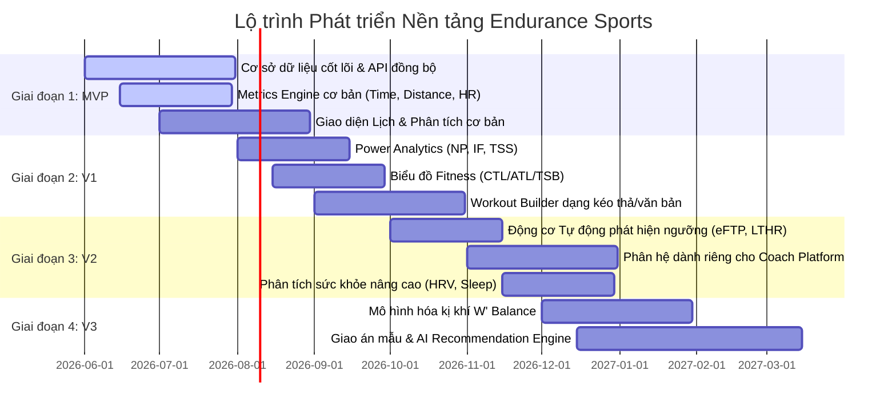

# Chương 16: Lộ trình Phát triển Sản phẩm (Product Roadmap)

Xây dựng một nền tảng thể thao sức bền tương đương TrainingPeaks là một dự án khổng lồ. Cố gắng phát triển toàn bộ các tính năng và chỉ số phân tích phức tạp ngay từ đầu sẽ dẫn đến việc trễ hạn phát hành, lãng phí tài nguyên và rủi ro thất bại cao. Chương này phác thảo một lộ trình phát triển chia làm nhiều giai đoạn cụ thể, đi từ cốt lõi sinh lý cơ bản đến các tính năng tự động nâng cao bằng trí tuệ nhân tạo.

---

## 1. Phân kỳ Phát triển (Development Phases)



### Giai đoạn 1: Sản phẩm khả dụng tối thiểu (MVP)
*   **Mục tiêu**: Thiết lập nền móng kỹ thuật và khả năng đồng bộ dữ liệu ổn định từ thiết bị.
*   **Chỉ số phát triển trước**:
    *   Thời gian (Duration), Quãng đường (Distance), Cao độ (Elevation), Nhịp tim trung bình ($HR_{avg}$), Tốc độ trung bình (Average Speed), Vòng quay chân (Cadence).
*   **Tính năng cốt lõi**:
    *   Đồng bộ hóa tự động qua Garmin Connect API và Wahoo Cloud.
    *   Trình đọc tệp FIT/TCX cơ bản.
    *   Giao diện Lịch tập đơn giản cho phép xem các buổi tập đã hoàn thành.
    *   Trang thông tin cá nhân (Athlete Profile) cho phép nhập thủ công FTP, LTHR và Nhịp tim tối đa.

### Giai đoạn 2: Phiên bản V1 (Phân tích nâng cao)
*   **Mục tiêu**: Cung cấp công cụ phân tích đủ dùng cho vận động viên nâng cao và bán chuyên nghiệp.
*   **Chỉ số phát triển**:
    *   NP (Công suất chuẩn hóa), VI (Chỉ số biến động), IF (Hệ số cường độ), EF (Hệ số hiệu quả).
    *   Tải tập luyện: TSS (Công suất), hrTSS (Nhịp tim), rTSS (Tốc độ chạy bộ).
    *   Thể lực tích lũy (CTL), Mệt mỏi ngắn hạn (ATL), Trạng thái phong độ (TSB).
*   **Tính năng cốt lõi**:
    *   Trình soạn thảo bài tập cấu trúc (Structured Workout Builder) dịch đổi tự động sang thiết bị Garmin.
    *   Biểu đồ quản lý phong độ (Performance Management Chart - PMC) tương tác.
    *   Vẽ biểu đồ dòng dữ liệu giây (Time-series Stream) dạng đa trục.

### Giai đoạn 3: Phiên bản V2 (Hệ sinh thái Huấn luyện viên & Sức khỏe)
*   **Mục tiêu**: Thu hút Huấn luyện viên tham gia hệ thống và mở rộng phân tích sức khỏe toàn diện.
*   **Chỉ số phát triển**:
    *   HRV rMSSD, Điểm giấc ngủ (Sleep Score), Điểm Sẵn sàng (Readiness Score).
    *   Phát hiện tự động FTP, LTHR, Critical Pace.
*   **Tính năng cốt lõi**:
    *   Phân hệ dành riêng cho Coach: Quản lý danh sách vận động viên, bảng theo dõi tuân thủ tập luyện (Compliance Board), bình luận phản hồi thời gian thực.
    *   Thư viện bài tập dùng chung cho huấn luyện viên.
    *   Đồng bộ hóa dữ liệu sức khỏe từ Apple Health và Google Fit.

### Giai đoạn 4: Phiên bản V3 (Mô hình hóa đỉnh cao & AI)
*   **Mục tiêu**: Vượt trội hơn các đối thủ cạnh tranh bằng công nghệ mô hình hóa sinh lý học và AI.
*   **Chỉ số phát triển**:
    *   Công suất tới hạn (Critical Power), $W'$ Balance (Cân bằng năng lượng kị khí).
    *   Dự phóng Thể lực (Projected CTL/ATL/TSB) dựa trên lịch trình bài tập tương lai.
*   **Tính năng cốt lõi**:
    *   Trình thiết kế biểu đồ tùy biến cho chuyên gia (Custom Chart Engine tương tự WKO5).
    *   Công cụ gợi ý bài tập tự động (AI Recommendation Engine): Tự động điều chỉnh độ khó của bài tập ngày hôm nay nếu chỉ số HRV buổi sáng của vận động viên cảnh báo quá tải.

---

## 2. Mối quan hệ Phụ thuộc giữa các Chỉ số và Tính năng

*   **Tính năng "Bản đồ thể lực CTL/ATL"** phụ thuộc vào $\Rightarrow$ **Điểm số Tải tập luyện (TSS / hrTSS)**.
*   **Điểm số Tải tập luyện (TSS)"** phụ thuộc vào $\Rightarrow$ **Các ngưỡng sinh lý (FTP / LTHR)** và **Công suất chuẩn hóa (NP)**.
*   **Tính năng "Đồng bộ bài tập cấu trúc lên Garmin"** phụ thuộc vào $\Rightarrow$ **Ngôn ngữ mô tả bài tập (Workout DSL / JSON Structure)** và **Phân vùng tập luyện (Training Zones)**.
*   **Đề xuất "Điểm Sẵn sàng tập luyện (Readiness Score)"** phụ thuộc vào $\Rightarrow$ **Dữ liệu sức khỏe hàng ngày (HRV, Sleep)** và **Mệt mỏi ngắn hạn (ATL)**.

---

## 3. Ví dụ thực tế

### Ví dụ về Athlete
Vận động viên A sử dụng phiên bản MVP của hệ thống: Chỉ xem được lịch sử bài chạy, cự ly và nhịp tim. Khi hệ thống cập nhật lên bản V1, A bắt đầu thấy điểm TSS tích lũy và biết được hôm nay mình đang khỏe hơn hay đang mệt mỏi trên biểu đồ Fitness.

### Ví dụ về Coach
Huấn luyện viên B chờ đợi phiên bản V2 phát hành để có thể mời toàn bộ học viên của mình vào hệ thống, quản lý giáo án hàng tuần thông qua Thư viện bài tập dùng chung và theo dõi độ tuân thủ giáo án của họ qua màu sắc hiển thị trên Dashboard.

### Ví dụ về Product
Product Owner sử dụng lộ trình này để từ chối các yêu cầu phát triển tính năng phức tạp như "Tính toán W' Balance kị khí" trong giai đoạn MVP. PO lập luận: *"Nếu chưa có dữ liệu Power và công thức tính FTP ổn định ở MVP, việc xây dựng mô hình W' kị khí là vô nghĩa."*

### Ví dụ về Cơ sở dữ liệu (Database Schema)
Bổ sung trường phiên bản tính năng (Feature Toggle) vào bảng cài đặt hệ thống để kích hoạt dần các phân hệ theo lộ trình:

```sql
CREATE TABLE platform_feature_flags (
    feature_key VARCHAR(100) PRIMARY KEY, -- 'workout_builder', 'auto_threshold_detect', 'w_prime_balance'
    is_enabled BOOLEAN NOT NULL DEFAULT FALSE,
    rolled_out_to_percent INT NOT NULL DEFAULT 0, -- Phục vụ cho việc A/B Testing hoặc ra mắt cuốn chiếu
    updated_at TIMESTAMP WITH TIME ZONE DEFAULT CURRENT_TIMESTAMP
);
```

### Ví dụ về Giao diện người dùng (UI)
*   Trong giai đoạn MVP, màn hình cấu hình hồ sơ chỉ có các ô nhập liệu thủ công cho FTP và LTHR.
*   Ở phiên bản V2, xuất hiện thêm nút `[Tự động phát hiện]` bên cạnh các ô nhập liệu này để kích hoạt động cơ tự động phân tích.

---

## 4. Sai lầm phổ biến khi thiết kế sản phẩm (Common Pitfalls)

1.  **Xây dựng Workout Builder trước khi xây dựng hệ thống Phân vùng tập luyện (Training Zones)**:
    *   *Sai lầm*: Cho phép huấn luyện viên dựng bài tập có cấu trúc nhưng chưa có hệ thống lưu trữ và tính toán Zone của vận động viên. Kết quả là bài tập cấu trúc không thể dịch đổi sang giá trị tuyệt đối (ví dụ: Watt hay BPM) để đồng bộ sang đồng hồ Garmin.
    *   *Giải pháp*: Luôn phát triển hệ thống quản lý ngưỡng (Thresholds) và phân vùng (Zones) ở giai đoạn MVP trước khi bắt tay vào xây dựng Workout Builder ở V1.
2.  **Đánh giá thấp độ phức tạp của việc tích hợp Garmin Connect API**:
    *   *Sai lầm*: Nghĩ rằng việc tích hợp Garmin API chỉ mất 1-2 tuần. Garmin Connect API yêu cầu quy trình phê duyệt doanh nghiệp nghiêm ngặt, ký hợp đồng pháp lý, kiểm thử bảo mật dữ liệu người dùng và đóng phí đăng ký phát triển (nếu có).
    *   *Giải pháp*: Đăng ký tài khoản nhà phát triển Garmin và bắt đầu quy trình làm việc với đội ngũ hỗ trợ của Garmin ngay từ tuần đầu tiên triển khai dự án MVP. Trong lúc đợi duyệt, sử dụng cơ chế upload tệp tin `.fit` thủ công (Manual Upload Component) để kiểm thử luồng xử lý Backend.
3.  **Cố gắng tự xây dựng bộ phân tích tệp FIT từ đầu (Don't Reinvent the Wheel)**:
    *   *Sai lầm*: Senior engineer cố gắng viết code C# hoặc Go để tự đọc dữ liệu nhị phân từ tệp FIT thô theo tài liệu FIT SDK. Việc này mất nhiều tuần và rất dễ phát sinh lỗi khi gặp các dòng dữ liệu lạ của các dòng đồng hồ khác nhau.
    *   *Giải pháp*: Sử dụng các thư viện mã nguồn mở đã được cộng đồng kiểm thử qua nhiều năm để parse tệp FIT (ví dụ: thư viện `fit-sdk` chính thức của Dynastream, hoặc thư viện Python `fitparse`, Golang `fit` package). Tập trung nguồn lực kỹ sư vào việc phát triển các thuật toán phân tích sinh lý (NP, TSS, TSB) tạo ra giá trị cốt lõi của sản phẩm.
